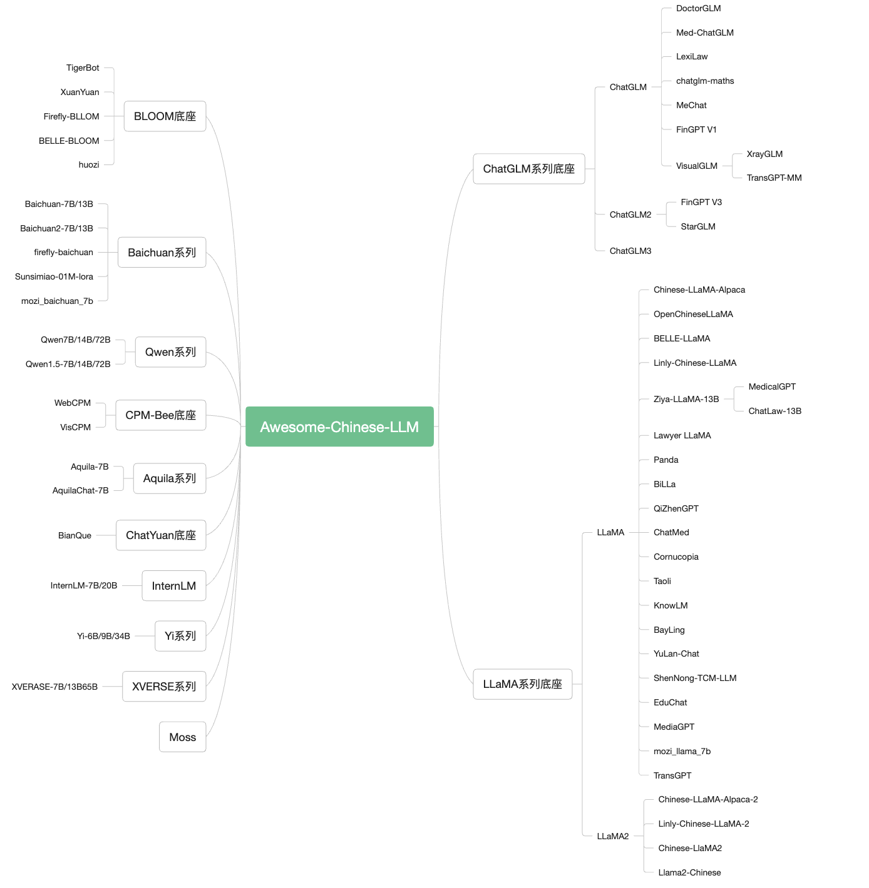
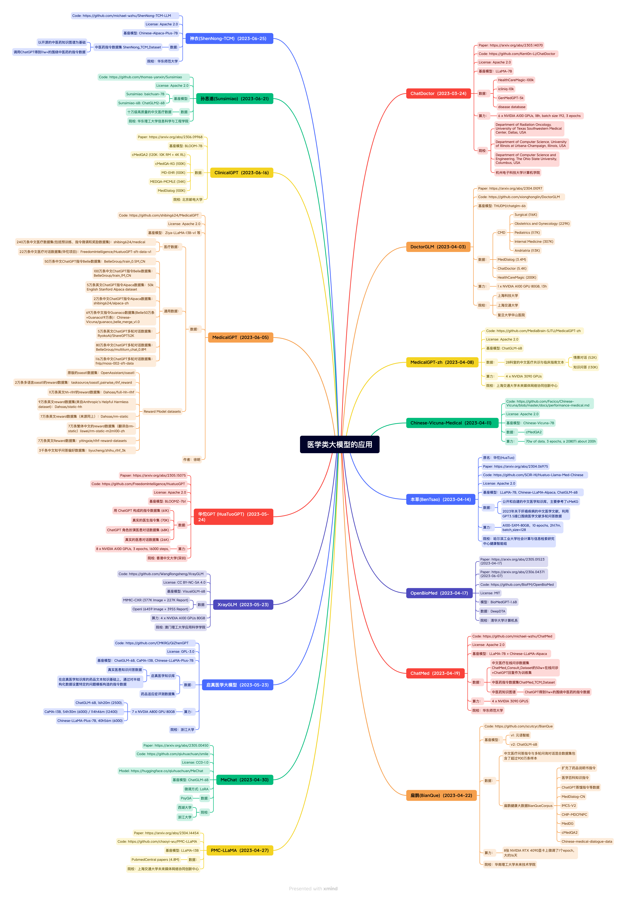
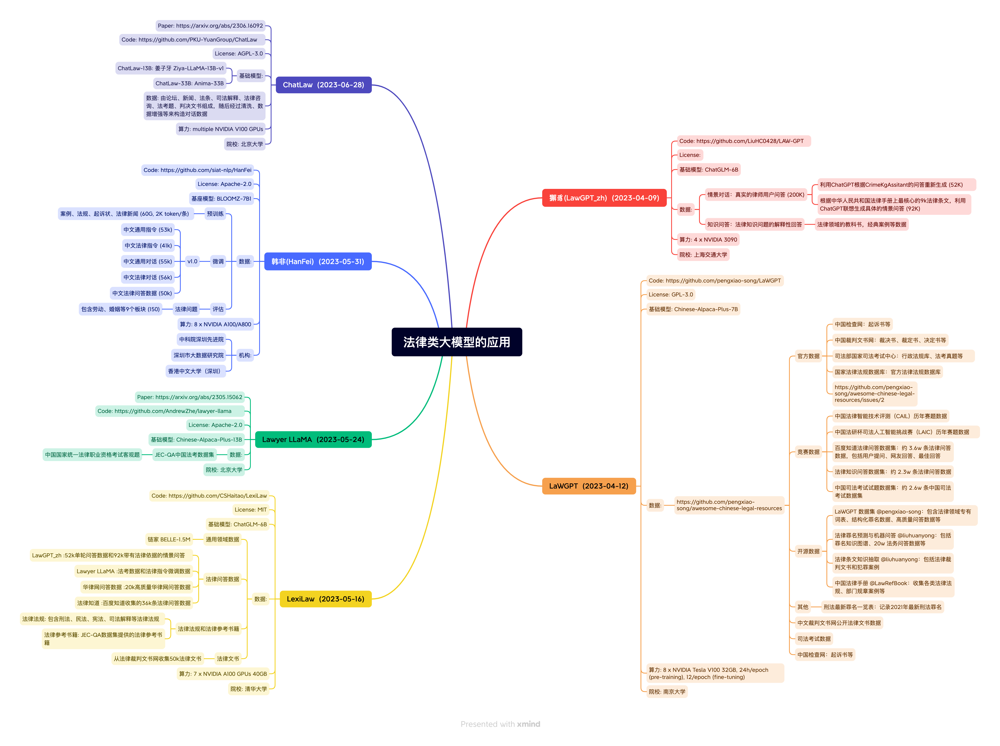

# AI共享知识库，欢迎协作完善

## 模型微调
TODO

## 本地知识库搭建
TODO

欢迎共享AI相关知识
## 全世界最好的大语言模型资源汇总
fork from: https://github.com/WangRongsheng/awesome-LLM-resourses

#### Contents

- [数据 Data](#数据-Data)
- [微调 Fine-Tuning](#微调-Fine-Tuning)
- [推理 Inference](#推理-Inference)
- [评估 Evaluation](#评估-Evaluation)
- [体验 Usage](#体验-Usage)
- [知识库 RAG](#知识库-RAG)
- [智能体 Agents](#智能体-Agents)
- [搜索 Search](#搜索-Search)
- [书籍 Book](#书籍-Book)
- [课程 Course](#课程-Course)
- [教程 Tutorial](#教程-Tutorial)
- [论文 Paper](#论文-Paper)
- [社区 Community](#社区-Community)
- [Open o1](#Open-o1)
- [Small Language Model](#Small-Language-Model)
- [Small Vision Language Model](#Small-Vision-Language-Model)
- [Tips](#tips)

## 数据 Data

> [!NOTE]
> 
> 此处命名为`数据`，但这里并没有提供具体数据集，而是提供了处理获取大规模数据的方法

1. [AotoLabel](https://github.com/refuel-ai/autolabel): Label, clean and enrich text datasets with LLMs.
2. [LabelLLM](https://github.com/opendatalab/LabelLLM): The Open-Source Data Annotation Platform.
3. [data-juicer](https://github.com/modelscope/data-juicer): A one-stop data processing system to make data higher-quality, juicier, and more digestible for LLMs!
4. [OmniParser](https://github.com/jf-tech/omniparser): a native Golang ETL streaming parser and transform library for CSV, JSON, XML, EDI, text, etc.
5. [MinerU](https://github.com/opendatalab/MinerU): MinerU is a one-stop, open-source, high-quality data extraction tool, supports PDF/webpage/e-book extraction.
6. [PDF-Extract-Kit](https://github.com/opendatalab/PDF-Extract-Kit): A Comprehensive Toolkit for High-Quality PDF Content Extraction.
7. [Parsera](https://github.com/raznem/parsera): Lightweight library for scraping web-sites with LLMs.
8. [Sparrow](https://github.com/katanaml/sparrow): Sparrow is an innovative open-source solution for efficient data extraction and processing from various documents and images.
9. [Docling](https://github.com/DS4SD/docling): Get your documents ready for gen AI.
10. [GOT-OCR2.0](https://github.com/Ucas-HaoranWei/GOT-OCR2.0): OCR Model.
11. [LLM Decontaminator](https://github.com/lm-sys/llm-decontaminator): Rethinking Benchmark and Contamination for Language Models with Rephrased Samples.
12. [DataTrove](https://github.com/huggingface/datatrove): DataTrove is a library to process, filter and deduplicate text data at a very large scale.
13. [llm-swarm](https://github.com/huggingface/llm-swarm/tree/main/examples/textbooks): Generate large synthetic datasets like [Cosmopedia](https://huggingface.co/datasets/HuggingFaceTB/cosmopedia).
14. [Distilabel](https://github.com/argilla-io/distilabel): Distilabel is a framework for synthetic data and AI feedback for engineers who need fast, reliable and scalable pipelines based on verified research papers.
15. [Common-Crawl-Pipeline-Creator](https://huggingface.co/spaces/lhoestq/Common-Crawl-Pipeline-Creator): The Common Crawl Pipeline Creator.
16. [Tabled](https://github.com/VikParuchuri/tabled): Detect and extract tables to markdown and csv.
17. [Zerox](https://github.com/getomni-ai/zerox): Zero shot pdf OCR with gpt-4o-mini.
18. [DocLayout-YOLO](https://github.com/opendatalab/DocLayout-YOLO): Enhancing Document Layout Analysis through Diverse Synthetic Data and Global-to-Local Adaptive Perception.
19. [TensorZero](https://github.com/tensorzero/tensorzero): make LLMs improve through experience.
20. [Promptwright](https://github.com/StacklokLabs/promptwright): Generate large synthetic data using a local LLM.
21. [pdf-extract-api](https://github.com/CatchTheTornado/pdf-extract-api): Document (PDF) extraction and parse API using state of the art modern OCRs + Ollama supported models.
22. [pdf2htmlEX](https://github.com/pdf2htmlEX/pdf2htmlEX): Convert PDF to HTML without losing text or format.
23. [Extractous](https://github.com/yobix-ai/extractous): Fast and efficient unstructured data extraction. Written in Rust with bindings for many languages.
24. [MegaParse](https://github.com/QuivrHQ/MegaParse): File Parser optimised for LLM Ingestion with no loss.
25. [MarkItDown](https://github.com/microsoft/markitdown): Python tool for converting files and office documents to Markdown.
26. [datasketch](https://github.com/ekzhu/datasketch): datasketch gives you probabilistic data structures that can process and search very large amount of data super fast, with little loss of accuracy.
27. [semhash](https://github.com/MinishLab/semhash): lightweight and flexible tool for deduplicating datasets using semantic similarity.
28. [ReaderLM-v2](https://huggingface.co/jinaai/ReaderLM-v2): a 1.5B parameter language model that converts raw HTML into beautifully formatted markdown or JSON.
29. [Bespoke Curator](https://github.com/bespokelabsai/curator): Data Curation for Post-Training & Structured Data Extraction.
30. [LangKit](https://github.com/whylabs/langkit): An open-source toolkit for monitoring Large Language Models (LLMs). Extracts signals from prompts & responses, ensuring safety & security.
31. [Curator](https://github.com/bespokelabsai/curator): Synthetic Data curation for post-training and structured data extraction.

    <b><a href="#Contents">↥ back to top</a></b>

## 微调 Fine-Tuning

1. [LLaMA-Factory](https://github.com/hiyouga/LLaMA-Factory): Unify Efficient Fine-Tuning of 100+ LLMs.
2. [360-LLaMA-Factory](https://github.com/Qihoo360/360-LLaMA-Factory): Unify Efficient Fine-Tuning of 100+ LLMs. (add Sequence Parallelism for supporting long context training)
4. [unsloth](https://github.com/unslothai/unsloth): 2-5X faster 80% less memory LLM finetuning.
5. [TRL](https://huggingface.co/docs/trl/index): Transformer Reinforcement Learning.
6. [Firefly](https://github.com/yangjianxin1/Firefly): Firefly: 大模型训练工具，支持训练数十种大模型
7. [Xtuner](https://github.com/InternLM/xtuner): An efficient, flexible and full-featured toolkit for fine-tuning large models.
8. [torchtune](https://github.com/pytorch/torchtune): A Native-PyTorch Library for LLM Fine-tuning.
9. [Swift](https://github.com/modelscope/swift): Use PEFT or Full-parameter to finetune 200+ LLMs or 15+ MLLMs.
10. [AutoTrain](https://huggingface.co/autotrain): A new way to automatically train, evaluate and deploy state-of-the-art Machine Learning models.
11. [OpenRLHF](https://github.com/OpenLLMAI/OpenRLHF): An Easy-to-use, Scalable and High-performance RLHF Framework (Support 70B+ full tuning & LoRA & Mixtral & KTO).
12. [Ludwig](https://github.com/ludwig-ai/ludwig): Low-code framework for building custom LLMs, neural networks, and other AI models.
13. [mistral-finetune](https://github.com/mistralai/mistral-finetune): A light-weight codebase that enables memory-efficient and performant finetuning of Mistral's models.
14. [aikit](https://github.com/sozercan/aikit): Fine-tune, build, and deploy open-source LLMs easily!
15. [H2O-LLMStudio](https://github.com/h2oai/h2o-llmstudio): H2O LLM Studio - a framework and no-code GUI for fine-tuning LLMs.
16. [LitGPT](https://github.com/Lightning-AI/litgpt): Pretrain, finetune, deploy 20+ LLMs on your own data. Uses state-of-the-art techniques: flash attention, FSDP, 4-bit, LoRA, and more.
17. [LLMBox](https://github.com/RUCAIBox/LLMBox): A comprehensive library for implementing LLMs, including a unified training pipeline and comprehensive model evaluation.
18. [PaddleNLP](https://github.com/PaddlePaddle/PaddleNLP): Easy-to-use and powerful NLP and LLM library.
19. [workbench-llamafactory](https://github.com/NVIDIA/workbench-llamafactory): This is an NVIDIA AI Workbench example project that demonstrates an end-to-end model development workflow using Llamafactory.
20. [OpenRLHF](https://github.com/OpenLLMAI/OpenRLHF): An Easy-to-use, Scalable and High-performance RLHF Framework (70B+ PPO Full Tuning & Iterative DPO & LoRA & Mixtral).
21. [TinyLLaVA Factory](https://github.com/TinyLLaVA/TinyLLaVA_Factory): A Framework of Small-scale Large Multimodal Models.
22. [LLM-Foundry](https://github.com/mosaicml/llm-foundry): LLM training code for Databricks foundation models.
23. [lmms-finetune](https://github.com/zjysteven/lmms-finetune): A unified codebase for finetuning (full, lora) large multimodal models, supporting llava-1.5, qwen-vl, llava-interleave, llava-next-video, phi3-v etc.
24. [Simplifine](https://github.com/simplifine-llm/Simplifine): Simplifine lets you invoke LLM finetuning with just one line of code using any Hugging Face dataset or model.
25. [Transformer Lab](https://github.com/transformerlab/transformerlab-app): Open Source Application for Advanced LLM Engineering: interact, train, fine-tune, and evaluate large language models on your own computer.
26. [Liger-Kernel](https://github.com/linkedin/Liger-Kernel): Efficient Triton Kernels for LLM Training.
27. [ChatLearn](https://github.com/alibaba/ChatLearn): A flexible and efficient training framework for large-scale alignment.
28. [nanotron](https://github.com/huggingface/nanotron): Minimalistic large language model 3D-parallelism training.
29. [Proxy Tuning](https://github.com/alisawuffles/proxy-tuning): Tuning Language Models by Proxy.
30. [Effective LLM Alignment](https://github.com/VikhrModels/effective_llm_alignment/): Effective LLM Alignment Toolkit.
31. [Autotrain-advanced](https://github.com/huggingface/autotrain-advanced)
32. [Meta Lingua](https://github.com/facebookresearch/lingua): a lean, efficient, and easy-to-hack codebase to research LLMs.
33. [Vision-LLM Alignemnt](https://github.com/NiuTrans/Vision-LLM-Alignment): This repository contains the code for SFT, RLHF, and DPO, designed for vision-based LLMs, including the LLaVA models and the LLaMA-3.2-vision models.
34. [finetune-Qwen2-VL](https://github.com/zhangfaen/finetune-Qwen2-VL): Quick Start for Fine-tuning or continue pre-train Qwen2-VL Model.
35. [Online-RLHF](https://github.com/RLHFlow/Online-RLHF): A recipe for online RLHF and online iterative DPO.
36. [InternEvo](https://github.com/InternLM/InternEvo): an open-sourced lightweight training framework aims to support model pre-training without the need for extensive dependencies.
37. [veRL](https://github.com/volcengine/verl): Volcano Engine Reinforcement Learning for LLM.
38. [Axolotl](https://axolotl-ai-cloud.github.io/axolotl/): Axolotl is designed to work with YAML config files that contain everything you need to preprocess a dataset, train or fine-tune a model, run model inference or evaluation, and much more.
39. [Oumi](https://github.com/oumi-ai/oumi): Everything you need to build state-of-the-art foundation models, end-to-end.
40. [Kiln](https://github.com/Kiln-AI/Kiln): The easiest tool for fine-tuning LLM models, synthetic data generation, and collaborating on datasets.

    <b><a href="#Contents">↥ back to top</a></b>

## 推理 Inference

1. [ollama](https://github.com/ollama/ollama): Get up and running with Llama 3, Mistral, Gemma, and other large language models.
2. [Open WebUI](https://github.com/open-webui/open-webui): User-friendly WebUI for LLMs (Formerly Ollama WebUI).
3. [Text Generation WebUI](https://github.com/oobabooga/text-generation-webui): A Gradio web UI for Large Language Models. Supports transformers, GPTQ, AWQ, EXL2, llama.cpp (GGUF), Llama models.
4. [Xinference](https://github.com/xorbitsai/inference): A powerful and versatile library designed to serve language, speech recognition, and multimodal models.
5. [LangChain](https://github.com/langchain-ai/langchain): Build context-aware reasoning applications.
6. [LlamaIndex](https://github.com/run-llama/llama_index): A data framework for your LLM applications.
7. [lobe-chat](https://github.com/lobehub/lobe-chat): an open-source, modern-design LLMs/AI chat framework. Supports Multi AI Providers, Multi-Modals (Vision/TTS) and plugin system.
8. [TensorRT-LLM](https://github.com/NVIDIA/TensorRT-LLM): TensorRT-LLM provides users with an easy-to-use Python API to define Large Language Models (LLMs) and build TensorRT engines that contain state-of-the-art optimizations to perform inference efficiently on NVIDIA GPUs.
9. [vllm](https://github.com/vllm-project/vllm): A high-throughput and memory-efficient inference and serving engine for LLMs.
10. [LlamaChat](https://github.com/alexrozanski/LlamaChat): Chat with your favourite LLaMA models in a native macOS app.
11. [NVIDIA ChatRTX](https://www.nvidia.com/en-us/ai-on-rtx/chatrtx/): ChatRTX is a demo app that lets you personalize a GPT large language model (LLM) connected to your own content—docs, notes, or other data.
12. [LM Studio](https://lmstudio.ai/): Discover, download, and run local LLMs.
13. [chat-with-mlx](https://github.com/qnguyen3/chat-with-mlx): Chat with your data natively on Apple Silicon using MLX Framework.
14. [LLM Pricing](https://llmpricecheck.com/): Quickly Find the Perfect Large Language Models (LLM) API for Your Budget! Use Our Free Tool for Instant Access to the Latest Prices from Top Providers.
15. [Open Interpreter](https://github.com/OpenInterpreter/open-interpreter): A natural language interface for computers.
16. [Chat-ollama](https://github.com/sugarforever/chat-ollama): An open source chatbot based on LLMs. It supports a wide range of language models, and knowledge base management.
17. [chat-ui](https://github.com/huggingface/chat-ui): Open source codebase powering the HuggingChat app.
18. [MemGPT](https://github.com/cpacker/MemGPT): Create LLM agents with long-term memory and custom tools.
19. [koboldcpp](https://github.com/LostRuins/koboldcpp): A simple one-file way to run various GGML and GGUF models with KoboldAI's UI.
20. [LLMFarm](https://github.com/guinmoon/LLMFarm): llama and other large language models on iOS and MacOS offline using GGML library.
21. [enchanted](https://github.com/AugustDev/enchanted): Enchanted is iOS and macOS app for chatting with private self hosted language models such as Llama2, Mistral or Vicuna using Ollama.
22. [Flowise](https://github.com/FlowiseAI/Flowise): Drag & drop UI to build your customized LLM flow.
23. [Jan](https://github.com/janhq/jan): Jan is an open source alternative to ChatGPT that runs 100% offline on your computer. Multiple engine support (llama.cpp, TensorRT-LLM).
24. [LMDeploy](https://github.com/InternLM/lmdeploy): LMDeploy is a toolkit for compressing, deploying, and serving LLMs.
25. [RouteLLM](https://github.com/lm-sys/RouteLLM): A framework for serving and evaluating LLM routers - save LLM costs without compromising quality!
26. [MInference](https://github.com/microsoft/MInference): About
To speed up Long-context LLMs' inference, approximate and dynamic sparse calculate the attention, which reduces inference latency by up to 10x for pre-filling on an A100 while maintaining accuracy.
27. [Mem0](https://github.com/mem0ai/mem0): The memory layer for Personalized AI.
28. [SGLang](https://github.com/sgl-project/sglang): SGLang is yet another fast serving framework for large language models and vision language models.
29. [AirLLM](https://github.com/lyogavin/airllm): AirLLM optimizes inference memory usage, allowing 70B large language models to run inference on a single 4GB GPU card without quantization, distillation and pruning. And you can run 405B Llama3.1 on 8GB vram now.
30. [LLMHub](https://github.com/jmather/llmhub): LLMHub is a lightweight management platform designed to streamline the operation and interaction with various language models (LLMs).
31. [YuanChat](https://github.com/IEIT-Yuan/YuanChat)
32. [LiteLLM](https://github.com/BerriAI/litellm): Call all LLM APIs using the OpenAI format [Bedrock, Huggingface, VertexAI, TogetherAI, Azure, OpenAI, Groq etc.]
33. [GuideLLM](https://github.com/neuralmagic/guidellm): GuideLLM is a powerful tool for evaluating and optimizing the deployment of large language models (LLMs).
34. [LLM-Engines](https://github.com/jdf-prog/LLM-Engines): A unified inference engine for large language models (LLMs) including open-source models (VLLM, SGLang, Together) and commercial models (OpenAI, Mistral, Claude).
35. [OARC](https://github.com/Leoleojames1/ollama_agent_roll_cage): ollama_agent_roll_cage (OARC) is a local python agent fusing ollama llm's with Coqui-TTS speech models, Keras classifiers, Llava vision, Whisper recognition, and more to create a unified chatbot agent for local, custom automation.
36. [g1](https://github.com/bklieger-groq/g1): Using Llama-3.1 70b on Groq to create o1-like reasoning chains.
37. [MemoryScope](https://github.com/modelscope/MemoryScope): MemoryScope provides LLM chatbots with powerful and flexible long-term memory capabilities, offering a framework for building such abilities.
38. [OpenLLM](https://github.com/bentoml/OpenLLM): Run any open-source LLMs, such as Llama 3.1, Gemma, as OpenAI compatible API endpoint in the cloud.
39. [Infinity](https://github.com/infiniflow/infinity): The AI-native database built for LLM applications, providing incredibly fast hybrid search of dense embedding, sparse embedding, tensor and full-text.
40. [optillm](https://github.com/codelion/optillm): an OpenAI API compatible optimizing inference proxy which implements several state-of-the-art techniques that can improve the accuracy and performance of LLMs.
41. [LLaMA Box](https://github.com/gpustack/llama-box): LLM inference server implementation based on llama.cpp.
42. [ZhiLight](https://github.com/zhihu/ZhiLight): A highly optimized inference acceleration engine for Llama and its variants.
43. [DashInfer](https://github.com/modelscope/dash-infer): DashInfer is a native LLM inference engine aiming to deliver industry-leading performance atop various hardware architectures.
44. [LocalAI](https://github.com/mudler/LocalAI): The free, Open Source alternative to OpenAI, Claude and others. Self-hosted and local-first. Drop-in replacement for OpenAI, running on consumer-grade hardware. No GPU required.

    <b><a href="#Contents">↥ back to top</a></b>

## 评估 Evaluation

1. [lm-evaluation-harness](https://github.com/EleutherAI/lm-evaluation-harness): A framework for few-shot evaluation of language models.
2. [opencompass](https://github.com/open-compass/opencompass): OpenCompass is an LLM evaluation platform, supporting a wide range of models (Llama3, Mistral, InternLM2,GPT-4,LLaMa2, Qwen,GLM, Claude, etc) over 100+ datasets.
3. [llm-comparator](https://github.com/PAIR-code/llm-comparator): LLM Comparator is an interactive data visualization tool for evaluating and analyzing LLM responses side-by-side, developed.
4. [EvalScope](https://github.com/modelscope/evalscope)
5. [Weave](https://weave-docs.wandb.ai/guides/core-types/evaluations): A lightweight toolkit for tracking and evaluating LLM applications.
6. [MixEval](https://github.com/Psycoy/MixEval/): Deriving Wisdom of the Crowd from LLM Benchmark Mixtures.
7. [Evaluation guidebook](https://github.com/huggingface/evaluation-guidebook): If you've ever wondered how to make sure an LLM performs well on your specific task, this guide is for you!
8. [Ollama Benchmark](https://github.com/aidatatools/ollama-benchmark): LLM Benchmark for Throughput via Ollama (Local LLMs).
9. [VLMEvalKit](https://github.com/open-compass/VLMEvalKit): Open-source evaluation toolkit of large vision-language models (LVLMs), support ~100 VLMs, 40+ benchmarks.
10. [AGI-Eval](https://agi-eval.cn/mvp/home)
11. [EvalScope](https://github.com/modelscope/evalscope): A streamlined and customizable framework for efficient large model evaluation and performance benchmarking.

`LLM API 服务平台`：
1. [Groq](https://groq.com/)
2. [硅基流动](https://cloud.siliconflow.cn/models)
3. [火山引擎](https://www.volcengine.com/product/ark)
4. [文心千帆](https://qianfan.cloud.baidu.com/)
5. [DashScope](https://dashscope.aliyun.com/)
6. [aisuite](https://github.com/andrewyng/aisuite)
7. [DeerAPI](https://www.deerapi.com/)
8. [Qwen-Chat](https://chat.qwenlm.ai/)
9. [DeepSeek-v3](https://www.deepseek.com/)

    <b><a href="#Contents">↥ back to top</a></b>

## 体验 Usage

1. [LMSYS Chatbot Arena: Benchmarking LLMs in the Wild](https://arena.lmsys.org/)
2. [CompassArena 司南大模型竞技场](https://modelscope.cn/studios/opencompass/CompassArena/summary)
3. [琅琊榜](https://langyb.com/)
4. [Huggingface Spaces](https://huggingface.co/spaces)
5. [WiseModel Spaces](https://wisemodel.cn/spaces)
6. [Poe](https://poe.com/)
7. [林哥的大模型野榜](https://lyihub.com/)
8. [OpenRouter](https://openrouter.ai/)
9. [AnyChat](https://huggingface.co/spaces/akhaliq/anychat)

    <b><a href="#Contents">↥ back to top</a></b>

## 知识库 RAG

1. [AnythingLLM](https://github.com/Mintplex-Labs/anything-llm): The all-in-one AI app for any LLM with full RAG and AI Agent capabilites.
2. [MaxKB](https://github.com/1Panel-dev/MaxKB): 基于 LLM 大语言模型的知识库问答系统。开箱即用，支持快速嵌入到第三方业务系统
3. [RAGFlow](https://github.com/infiniflow/ragflow): An open-source RAG (Retrieval-Augmented Generation) engine based on deep document understanding.
4. [Dify](https://github.com/langgenius/dify): An open-source LLM app development platform. Dify's intuitive interface combines AI workflow, RAG pipeline, agent capabilities, model management, observability features and more, letting you quickly go from prototype to production.
5. [FastGPT](https://github.com/labring/FastGPT): A knowledge-based platform built on the LLM, offers out-of-the-box data processing and model invocation capabilities, allows for workflow orchestration through Flow visualization.
6. [Langchain-Chatchat](https://github.com/chatchat-space/Langchain-Chatchat): 基于 Langchain 与 ChatGLM 等不同大语言模型的本地知识库问答
7. [QAnything](https://github.com/netease-youdao/QAnything): Question and Answer based on Anything.
8. [Quivr](https://github.com/QuivrHQ/quivr): A personal productivity assistant (RAG) ⚡️🤖 Chat with your docs (PDF, CSV, ...) & apps using Langchain, GPT 3.5 / 4 turbo, Private, Anthropic, VertexAI, Ollama, LLMs, Groq that you can share with users ! Local & Private alternative to OpenAI GPTs & ChatGPT powered by retrieval-augmented generation.
9. [RAG-GPT](https://github.com/open-kf/rag-gpt): RAG-GPT, leveraging LLM and RAG technology, learns from user-customized knowledge bases to provide contextually relevant answers for a wide range of queries, ensuring rapid and accurate information retrieval.
10. [Verba](https://github.com/weaviate/Verba): Retrieval Augmented Generation (RAG) chatbot powered by Weaviate.
11. [FlashRAG](https://github.com/RUC-NLPIR/FlashRAG): A Python Toolkit for Efficient RAG Research.
12. [GraphRAG](https://github.com/microsoft/graphrag): A modular graph-based Retrieval-Augmented Generation (RAG) system.
13. [LightRAG](https://github.com/SylphAI-Inc/LightRAG): LightRAG helps developers with both building and optimizing Retriever-Agent-Generator pipelines.
14. [GraphRAG-Ollama-UI](https://github.com/severian42/GraphRAG-Ollama-UI): GraphRAG using Ollama with Gradio UI and Extra Features.
15. [nano-GraphRAG](https://github.com/gusye1234/nano-graphrag): A simple, easy-to-hack GraphRAG implementation.
16. [RAG Techniques](https://github.com/NirDiamant/RAG_Techniques): This repository showcases various advanced techniques for Retrieval-Augmented Generation (RAG) systems. RAG systems combine information retrieval with generative models to provide accurate and contextually rich responses.
17. [ragas](https://github.com/explodinggradients/ragas): Evaluation framework for your Retrieval Augmented Generation (RAG) pipelines.
18. [kotaemon](https://github.com/Cinnamon/kotaemon): An open-source clean & customizable RAG UI for chatting with your documents. Built with both end users and developers in mind.
19. [RAGapp](https://github.com/ragapp/ragapp): The easiest way to use Agentic RAG in any enterprise.
20. [TurboRAG](https://github.com/MooreThreads/TurboRAG): Accelerating Retrieval-Augmented Generation with Precomputed KV Caches for Chunked Text.
21. [LightRAG](https://github.com/HKUDS/LightRAG): Simple and Fast Retrieval-Augmented Generation.
22. [TEN](https://github.com/TEN-framework/ten_framework): the Next-Gen AI-Agent Framework, the world's first truly real-time multimodal AI agent framework.
23. [AutoRAG](https://github.com/Marker-Inc-Korea/AutoRAG): RAG AutoML tool for automatically finding an optimal RAG pipeline for your data.
24. [KAG](https://github.com/OpenSPG/KAG): KAG is a knowledge-enhanced generation framework based on OpenSPG engine, which is used to build knowledge-enhanced rigorous decision-making and information retrieval knowledge services.
25. [Fast-GraphRAG](https://github.com/circlemind-ai/fast-graphrag): RAG that intelligently adapts to your use case, data, and queries.
26. [Tiny-GraphRAG](https://github.com/limafang/tiny-graphrag)
27. [DB-GPT GraphRAG](https://github.com/eosphoros-ai/DB-GPT/tree/main/dbgpt/storage/knowledge_graph): DB-GPT GraphRAG integrates both triplet-based knowledge graphs and document structure graphs while leveraging community and document retrieval mechanisms to enhance RAG capabilities, achieving comparable performance while consuming only 50% of the tokens required by Microsoft's GraphRAG. Refer to the DB-GPT [Graph RAG User Manual](http://docs.dbgpt.cn/docs/cookbook/rag/graph_rag_app_develop/) for details.
28. [Chonkie](https://github.com/bhavnicksm/chonkie): The no-nonsense RAG chunking library that's lightweight, lightning-fast, and ready to CHONK your texts.
29. [RAGLite](https://github.com/superlinear-ai/raglite): RAGLite is a Python toolkit for Retrieval-Augmented Generation (RAG) with PostgreSQL or SQLite.
30. [KAG](https://github.com/OpenSPG/KAG): KAG is a logical form-guided reasoning and retrieval framework based on OpenSPG engine and LLMs.
31. [CAG](https://github.com/hhhuang/CAG): CAG leverages the extended context windows of modern large language models (LLMs) by preloading all relevant resources into the model’s context and caching its runtime parameters.
32. [MiniRAG](https://github.com/HKUDS/MiniRAG): an extremely simple retrieval-augmented generation framework that enables small models to achieve good RAG performance through heterogeneous graph indexing and lightweight topology-enhanced retrieval.
33. [XRAG](https://github.com/DocAILab/XRAG): a benchmarking framework designed to evaluate the foundational components of advanced Retrieval-Augmented Generation (RAG) systems.

    <b><a href="#Contents">↥ back to top</a></b>

## 智能体 Agents

1. [AutoGen](https://github.com/microsoft/autogen): AutoGen is a framework that enables the development of LLM applications using multiple agents that can converse with each other to solve tasks. [AutoGen AIStudio](https://autogen-studio.com/)
2. [CrewAI](https://github.com/joaomdmoura/crewAI): Framework for orchestrating role-playing, autonomous AI agents. By fostering collaborative intelligence, CrewAI empowers agents to work together seamlessly, tackling complex tasks.
3. [Coze](https://www.coze.com/)
4. [AgentGPT](https://github.com/reworkd/AgentGPT): Assemble, configure, and deploy autonomous AI Agents in your browser.
5. [XAgent](https://github.com/OpenBMB/XAgent): An Autonomous LLM Agent for Complex Task Solving.
6. [MobileAgent](https://github.com/X-PLUG/MobileAgent): The Powerful Mobile Device Operation Assistant Family.
7. [Lagent](https://github.com/InternLM/lagent): A lightweight framework for building LLM-based agents.
8. [Qwen-Agent](https://github.com/QwenLM/Qwen-Agent): Agent framework and applications built upon Qwen2, featuring Function Calling, Code Interpreter, RAG, and Chrome extension.
9. [LinkAI](https://link-ai.tech/portal): 一站式 AI 智能体搭建平台
10. [Baidu APPBuilder](https://appbuilder.cloud.baidu.com/)
11. [agentUniverse](https://github.com/alipay/agentUniverse): agentUniverse is a LLM multi-agent framework that allows developers to easily build multi-agent applications. Furthermore, through the community, they can exchange and share practices of patterns across different domains.
12. [LazyLLM](https://github.com/LazyAGI/LazyLLM): 低代码构建多Agent大模型应用的开发工具
13. [AgentScope](https://github.com/modelscope/agentscope): Start building LLM-empowered multi-agent applications in an easier way.
14. [MoA](https://github.com/togethercomputer/MoA): Mixture of Agents (MoA) is a novel approach that leverages the collective strengths of multiple LLMs to enhance performance, achieving state-of-the-art results.
15. [Agently](https://github.com/Maplemx/Agently): AI Agent Application Development Framework.
16. [OmAgent](https://github.com/om-ai-lab/OmAgent): A multimodal agent framework for solving complex tasks.
17. [Tribe](https://github.com/StreetLamb/tribe): No code tool to rapidly build and coordinate multi-agent teams.
18. [CAMEL](https://github.com/camel-ai/camel): First LLM multi-agent framework and an open-source community dedicated to finding the scaling law of agents.
19. [PraisonAI](https://github.com/MervinPraison/PraisonAI/): PraisonAI application combines AutoGen and CrewAI or similar frameworks into a low-code solution for building and managing multi-agent LLM systems, focusing on simplicity, customisation, and efficient human-agent collaboration.
20. [IoA](https://github.com/openbmb/ioa): An open-source framework for collaborative AI agents, enabling diverse, distributed agents to team up and tackle complex tasks through internet-like connectivity.
21. [llama-agentic-system ](https://github.com/meta-llama/llama-agentic-system): Agentic components of the Llama Stack APIs.
22. [Agent Zero](https://github.com/frdel/agent-zero): Agent Zero is not a predefined agentic framework. It is designed to be dynamic, organically growing, and learning as you use it.
23. [Agents](https://github.com/aiwaves-cn/agents): An Open-source Framework for Data-centric, Self-evolving Autonomous Language Agents.
24. [AgentScope](https://github.com/modelscope/agentscope): Start building LLM-empowered multi-agent applications in an easier way.
25. [FastAgency](https://github.com/airtai/fastagency): The fastest way to bring multi-agent workflows to production.
26. [Swarm](https://github.com/openai/swarm): Framework for building, orchestrating and deploying multi-agent systems. Managed by OpenAI Solutions team. Experimental framework.
27. [Agent-S](https://github.com/simular-ai/Agent-S): an open agentic framework that uses computers like a human.
28. [PydanticAI](https://github.com/pydantic/pydantic-ai): Agent Framework / shim to use Pydantic with LLMs.
29. [Agentarium](https://github.com/Thytu/Agentarium): open-source framework for creating and managing simulations populated with AI-powered agents.
30. [smolagents](https://github.com/huggingface/smolagents): a barebones library for agents. Agents write python code to call tools and orchestrate other agents.

    <b><a href="#Contents">↥ back to top</a></b>

## 搜索 Search

1. [OpenSearch GPT](https://github.com/supermemoryai/opensearch-ai): SearchGPT / Perplexity clone, but personalised for you.
2. [MindSearch](https://github.com/InternLM/MindSearch): An LLM-based Multi-agent Framework of Web Search Engine (like Perplexity.ai Pro and SearchGPT).
3. [nanoPerplexityAI](https://github.com/Yusuke710/nanoPerplexityAI): The simplest open-source implementation of perplexity.ai.
4. [curiosity](https://github.com/jank/curiosity): Try to build a Perplexity-like user experience.
5. [MiniPerplx](https://github.com/zaidmukaddam/miniperplx): A minimalistic AI-powered search engine that helps you find information on the internet.

    <b><a href="#Contents">↥ back to top</a></b>

## 书籍 Book

1. [《大规模语言模型：从理论到实践》](https://intro-llm.github.io/)
2. [《大语言模型》](https://llmbook-zh.github.io/)
3. [《动手学大模型Dive into LLMs》](https://github.com/Lordog/dive-into-llms)
4. [《动手做AI Agent》](https://book.douban.com/subject/36884058/)
5. [《Build a Large Language Model (From Scratch)》](https://github.com/rasbt/LLMs-from-scratch)
6. [《多模态大模型》](https://github.com/HCPLab-SYSU/Book-of-MLM)
7. [《Generative AI Handbook: A Roadmap for Learning Resources》](https://genai-handbook.github.io/)
8. [《Understanding Deep Learning》](https://udlbook.github.io/udlbook/)
9. [《Illustrated book to learn about Transformers & LLMs》](https://www.reddit.com/r/MachineLearning/comments/1ew1hws/p_illustrated_book_to_learn_about_transformers/)
10. [《Building LLMs for Production: Enhancing LLM Abilities and Reliability with Prompting, Fine-Tuning, and RAG》](https://www.amazon.com/Building-LLMs-Production-Reliability-Fine-Tuning/dp/B0D4FFPFW8?crid=7OAXELUKGJE4&dib=eyJ2IjoiMSJ9.Qr3e3VSH8LSo_j1M7sV7GfS01q_W1LDYd2uGlvGJ8CW-t4DTlng6bSeOlZBryhp6HJN5K1HqWMVVgabU2wz2i9yLpy_AuaZN-raAEbenKx2NHtzZA3A4k-N7GpnldF1baCarA_V1CRF-aCdc9_3WSX7SaEzmpyDv22TTyltcKT74HAb2KiQqBGLhQS3cEAnzChcqGa1Xp-XhbMnplVwT7xZLApE3tGLhDOgi5GmSi9w.8SY_4NBEkm68YF4GwhDnz0r81ZB1d8jr-gK9IMJE5AE&dib_tag=se&keywords=building+llms+for+production&qid=1716376414&sprefix=building+llms+for+production,aps,101&sr=8-1&linkCode=sl1&tag=whatsai06-20&linkId=ee102fda07a0eb51710fcdd8b8d20c28&language=en_US&ref_=as_li_ss_tl)
11. [《大型语言模型实战指南：应用实践与场景落地》](https://github.com/liucongg/LLMsBook)
12. [《Hands-On Large Language Models》](https://github.com/handsOnLLM/Hands-On-Large-Language-Models)
13. [《自然语言处理：大模型理论与实践》](https://nlp-book.swufenlp.group/)
14. [《动手学强化学习》](https://hrl.boyuai.com/)
15. [《面向开发者的LLM入门教程》](https://datawhalechina.github.io/llm-cookbook/#/)
16. [《大模型基础》](https://github.com/ZJU-LLMs/Foundations-of-LLMs)
17. [Taming LLMs: A Practical Guide to LLM Pitfalls with Open Source Software ](https://www.tamingllms.com/)
18. [Foundations of Large Language Models](https://arxiv.org/abs/2501.09223)

    <b><a href="#Contents">↥ back to top</a></b>

## 课程 Course

> [LLM Resources Hub](https://llmresourceshub.vercel.app/)

1. [斯坦福 CS224N: Natural Language Processing with Deep Learning](https://web.stanford.edu/class/cs224n/)
2. [吴恩达: Generative AI for Everyone](https://www.deeplearning.ai/courses/generative-ai-for-everyone/)
3. [吴恩达: LLM series of courses](https://learn.deeplearning.ai/)
4. [ACL 2023 Tutorial: Retrieval-based Language Models and Applications](https://acl2023-retrieval-lm.github.io/)
5. [llm-course: Course to get into Large Language Models (LLMs) with roadmaps and Colab notebooks.](https://github.com/mlabonne/llm-course)
6. [微软: Generative AI for Beginners](https://github.com/microsoft/generative-ai-for-beginners)
7. [微软: State of GPT](https://www.youtube.com/watch?v=bZQun8Y4L2A)
8. [HuggingFace NLP Course](https://huggingface.co/learn/nlp-course/chapter1/1)
9. [清华 NLP 刘知远团队大模型公开课](https://www.bilibili.com/video/BV1UG411p7zv/?vd_source=c739db1ebdd361d47af5a0b8497417db)
10. [斯坦福 CS25: Transformers United V4](https://web.stanford.edu/class/cs25/)
11. [斯坦福 CS324: Large Language Models](https://stanford-cs324.github.io/winter2022/)
12. [普林斯顿 COS 597G (Fall 2022): Understanding Large Language Models](https://www.cs.princeton.edu/courses/archive/fall22/cos597G/)
13. [约翰霍普金斯 CS 601.471/671 NLP: Self-supervised Models](https://self-supervised.cs.jhu.edu/sp2023/index.html)
14. [李宏毅 GenAI课程](https://www.youtube.com/watch?v=yiY4nPOzJEg&list=PLJV_el3uVTsOePyfmkfivYZ7Rqr2nMk3W)
15. [openai-cookbook](https://github.com/openai/openai-cookbook): Examples and guides for using the OpenAI API.
16. [Hands on llms](https://github.com/iusztinpaul/hands-on-llms): Learn about LLM, LLMOps, and vector DBS for free by designing, training, and deploying a real-time financial advisor LLM system.
17. [滑铁卢大学 CS 886: Recent Advances on Foundation Models](https://cs.uwaterloo.ca/~wenhuche/teaching/cs886/)
18. [Mistral: Getting Started with Mistral](https://www.deeplearning.ai/short-courses/getting-started-with-mistral/)
19. [斯坦福 CS25: Transformers United V4](https://web.stanford.edu/class/cs25/)
20. [Coursera: Chatgpt 应用提示工程](https://www.coursera.org/learn/prompt-engineering)
21. [LangGPT](https://github.com/langgptai/LangGPT): Empowering everyone to become a prompt expert!
22. [mistralai-cookbook](https://github.com/mistralai/cookbook)
23. [Introduction to Generative AI 2024 Spring](https://speech.ee.ntu.edu.tw/~hylee/genai/2024-spring.php)
24. [build nanoGPT](https://github.com/karpathy/build-nanogpt): Video+code lecture on building nanoGPT from scratch.
25. [LLM101n](https://github.com/karpathy/LLM101n): Let's build a Storyteller.
26. [Knowledge Graphs for RAG](https://www.deeplearning.ai/short-courses/knowledge-graphs-rag/)
27. [LLMs From Scratch (Datawhale Version)](https://github.com/datawhalechina/llms-from-scratch-cn)
28. [OpenRAG](https://openrag.notion.site/Open-RAG-c41b2a4dcdea4527a7c1cd998e763595)
29. [通往AGI之路](https://waytoagi.feishu.cn/wiki/QPe5w5g7UisbEkkow8XcDmOpn8e)
30. [Andrej Karpathy - Neural Networks: Zero to Hero](https://www.youtube.com/playlist?list=PLAqhIrjkxbuWI23v9cThsA9GvCAUhRvKZ)
31. [Interactive visualization of Transformer](https://poloclub.github.io/transformer-explainer/)
32. [andysingal/llm-course](https://github.com/andysingal/llm-course)
33. [LM-class](https://lm-class.org/lectures)
34. [Google Advanced: Generative AI for Developers Learning Path](https://www.cloudskillsboost.google/paths/183)
35. [Anthropics：Prompt Engineering Interactive Tutorial](https://github.com/anthropics/courses/tree/master/prompt_engineering_interactive_tutorial/Anthropic%201P)
36. [LLMsBook](https://github.com/liucongg/LLMsBook)
37. [Large Language Model Agents](https://llmagents-learning.org/f24)
38. [Cohere LLM University](https://cohere.com/llmu)
39. [LLMs and Transformers](https://www.ambujtewari.com/LLM-fall2024/)
40. [Smol Vision](https://github.com/merveenoyan/smol-vision): Recipes for shrinking, optimizing, customizing cutting edge vision models.
41. [Multimodal RAG: Chat with Videos](https://www.deeplearning.ai/short-courses/multimodal-rag-chat-with-videos/)
42. [LLMs Interview Note](https://github.com/wdndev/llm_interview_note)
43. [RAG++ : From POC to production](https://www.wandb.courses/courses/rag-in-production): Advanced RAG course.
44. [Weights & Biases AI Academy](https://www.wandb.courses/pages/w-b-courses): Finetuning, building with LLMs, Structured outputs and more LLM courses.
45. [Prompt Engineering & AI tutorials & Resources](https://promptengineering.org/)
46. [Learn RAG From Scratch – Python AI Tutorial from a LangChain Engineer](https://www.youtube.com/watch?v=sVcwVQRHIc8)
47. [LLM Evaluation: A Complete Course](https://www.comet.com/site/llm-course/)
48. [HuggingFace Learn](https://huggingface.co/learn)
49. [Andrej Karpathy: Deep Dive into LLMs like ChatGPT](https://www.youtube.com/watch?v=7xTGNNLPyMI)

    <b><a href="#Contents">↥ back to top</a></b>

## 教程 Tutorial

1. [动手学大模型应用开发](https://datawhalechina.github.io/llm-universe/#/)
2. [AI开发者频道](https://techdiylife.github.io/blog/blog_list.html)
3. [B站：五里墩茶社](https://space.bilibili.com/615957867/?spm_id_from=333.999.0.0)
4. [B站：木羽Cheney](https://space.bilibili.com/3537113897241540/?spm_id_from=333.999.0.0)
5. [YTB：AI Anytime](https://www.youtube.com/channel/UC-zVytOQB62OwMhKRi0TDvg)
6. [B站：漆妮妮](https://space.bilibili.com/1262370256/?spm_id_from=333.999.0.0)
7. [Prompt Engineering Guide](https://www.promptingguide.ai/)
8. [YTB: AI超元域](https://www.youtube.com/@AIsuperdomain)
9. [B站：TechBeat人工智能社区](https://space.bilibili.com/209732435)
10. [B站：黄益贺](https://space.bilibili.com/322961825)
11. [B站：深度学习自然语言处理](https://space.bilibili.com/507524288)
12. [LLM Visualization](https://bbycroft.net/llm)
13. [知乎: 原石人类](https://www.zhihu.com/people/zhang-shi-tou-88-98/posts)
14. [B站：小黑黑讲AI](https://space.bilibili.com/1963375439/?spm_id_from=333.999.0.0)
15. [B站：面壁的车辆工程师](https://space.bilibili.com/669720247/?spm_id_from=333.999.0.0)
16. [B站：AI老兵文哲](https://space.bilibili.com/472543316/?spm_id_from=333.999.0.0)
17. [Large Language Models (LLMs) with Colab notebooks](https://mlabonne.github.io/blog/)
18. [YTB：IBM Technology](https://www.youtube.com/@IBMTechnology)
19. [YTB: Unify Reading Paper Group](https://www.youtube.com/playlist?list=PLwNuX3xB_tv91QvDXlW2TjrLGHW51uMul)
20. [Chip Huyen](https://huyenchip.com/blog/)
21. [How Much VRAM](https://github.com/AlexBodner/How_Much_VRAM)
22. [Blog: 科学空间（苏剑林）](https://kexue.fm/)
23. [YTB: Hyung Won Chung](https://www.youtube.com/watch?v=dbo3kNKPaUA)
24. [Blog: Tejaswi kashyap](https://medium.com/@tejaswi_kashyap)
25. [Blog: 小昇的博客](https://xiaosheng.blog/)
26. [知乎: ybq](https://www.zhihu.com/people/ybq-29-32/posts)
27. [W&B articles](https://wandb.ai/fully-connected)
28. [Huggingface Blog](https://huggingface.co/blog/zh)
29. [Blog: GbyAI](https://gby.ai/)
30. [Blog: mlabonne](https://mlabonne.github.io/blog/)
31. [LLM-Action](https://github.com/liguodongiot/llm-action)
32. [Blog: Lil’Log (OponAI)](https://lilianweng.github.io/)
33. [B站: 毛玉仁](https://space.bilibili.com/3546823125895398)
34. [AI-Guide-and-Demos](https://github.com/Hoper-J/AI-Guide-and-Demos-zh_CN)

    <b><a href="#Contents">↥ back to top</a></b>

## 论文 Paper

> [!NOTE]
> 🤝[Huggingface Daily Papers](https://huggingface.co/papers)、[Cool Papers](https://papers.cool/)、[ML Papers Explained](https://github.com/dair-ai/ML-Papers-Explained)

1. [Hermes-3-Technical-Report](https://nousresearch.com/wp-content/uploads/2024/08/Hermes-3-Technical-Report.pdf)
2. [The Llama 3 Herd of Models](https://arxiv.org/abs/2407.21783)
3. [Qwen Technical Report](https://arxiv.org/abs/2309.16609)
4. [Qwen2 Technical Report](https://arxiv.org/abs/2407.10671)
5. [Qwen2-vl Technical Report](https://arxiv.org/abs/2409.12191)
6. [DeepSeek LLM: Scaling Open-Source Language Models with Longtermism](https://arxiv.org/abs/2401.02954)
7. [DeepSeek-V2: A Strong, Economical, and Efficient Mixture-of-Experts Language Model](https://arxiv.org/abs/2405.04434)
8. [Baichuan 2: Open Large-scale Language Models](https://arxiv.org/abs/2309.10305)
9. [DataComp-LM: In search of the next generation of training sets for language models](https://arxiv.org/abs/2406.11794)
10. [OLMo: Accelerating the Science of Language Models](https://arxiv.org/abs/2402.00838)
11. [MAP-Neo: Highly Capable and Transparent Bilingual Large Language Model Series](https://arxiv.org/abs/2405.19327)
12. [Chinese Tiny LLM: Pretraining a Chinese-Centric Large Language Model](https://arxiv.org/abs/2404.04167)
13. [Phi-3 Technical Report: A Highly Capable Language Model Locally on Your Phone](https://arxiv.org/abs/2404.14219)
14. [Jamba-1.5: Hybrid Transformer-Mamba Models at Scale](https://arxiv.org/abs/2408.12570v1)
15. [Jamba: A Hybrid Transformer-Mamba Language Model](https://arxiv.org/abs/2403.19887)
16. [Textbooks Are All You Need](https://arxiv.org/abs/2306.11644)
17. [Unleashing the Power of Data Tsunami: A Comprehensive Survey on Data Assessment and Selection for Instruction Tuning of Language Models](https://arxiv.org/abs/2408.02085) `data`
18. [OLMoE: Open Mixture-of-Experts Language Models](https://arxiv.org/abs/2409.02060)
19. [Model Merging Paper](https://huggingface.co/collections/osanseviero/model-merging-65097893623330a3a51ead66)
20. [Baichuan-Omni Technical Report](https://arxiv.org/abs/2410.08565)
21. [1.5-Pints Technical Report: Pretraining in Days, Not Months – Your Language Model Thrives on Quality Data](https://arxiv.org/abs/2408.03506)
22. [Baichuan Alignment Technical Report](https://arxiv.org/abs/2410.14940v1)
23. [Hunyuan-Large: An Open-Source MoE Model with 52 Billion Activated Parameters by Tencent](https://arxiv.org/abs/2411.02265)
24. [Molmo and PixMo: Open Weights and Open Data for State-of-the-Art Multimodal Models](https://arxiv.org/abs/2409.17146)
25. [TÜLU 3: Pushing Frontiers in Open Language Model Post-Training](https://arxiv.org/abs/2411.15124)
26. [Phi-4 Technical Report](https://arxiv.org/abs/2412.08905)
27. [Expanding Performance Boundaries of Open-Source Multimodal Models with Model, Data, and Test-Time Scaling](https://arxiv.org/abs/2412.05271)
28. [Qwen2.5 Technical Report](https://arxiv.org/abs/2412.15115)
29. [YuLan-Mini: An Open Data-efficient Language Model](https://arxiv.org/abs/2412.17743)
30. [An Introduction to Vision-Language Modeling](https://arxiv.org/abs/2405.17247)
31. [DeepSeek V3 Technical Report](https://github.com/WangRongsheng/awesome-LLM-resourses/blob/main/docs/DeepSeek_V3.pdf)
32. [2 OLMo 2 Furious](https://arxiv.org/abs/2501.00656)
33. [Yi-Lightning Technical Report](https://arxiv.org/abs/2412.01253)
34. [DeepSeek-R1: Incentivizing Reasoning Capability in LLMs via Reinforcement Learning](https://github.com/deepseek-ai/DeepSeek-R1)
35. [KIMI K1.5](https://github.com/WangRongsheng/awesome-LLM-resourses/blob/main/docs/Kimi_k1.5.pdf)
36. [Eagle 2: Building Post-Training Data Strategies from Scratch for Frontier Vision-Language Models](https://arxiv.org/abs/2501.14818)

    <b><a href="#Contents">↥ back to top</a></b>

## 社区 Community

1. [魔乐社区](https://modelers.cn/)
2. [HuggingFace](https://huggingface.co/)
3. [ModelScope](https://modelscope.cn/)
4. [WiseModel](https://www.wisemodel.cn/)

    <b><a href="#Contents">↥ back to top</a></b>

## Open o1

> [!NOTE]
> 
> 开放的技术是我们永恒的追求

1. https://github.com/atfortes/Awesome-LLM-Reasoning
2. https://github.com/hijkzzz/Awesome-LLM-Strawberry
3. https://github.com/wjn1996/Awesome-LLM-Reasoning-Openai-o1-Survey
4. https://github.com/srush/awesome-o1
5. https://github.com/open-thought/system-2-research
6. https://github.com/ninehills/blog/issues/121
7. https://github.com/OpenSource-O1/Open-O1
8. https://github.com/GAIR-NLP/O1-Journey
9. https://github.com/marlaman/show-me
10. https://github.com/bklieger-groq/g1
11. https://github.com/Jaimboh/Llamaberry-Chain-of-Thought-Reasoning-in-AI
12. https://github.com/pseudotensor/open-strawberry
13. https://huggingface.co/collections/peakji/steiner-preview-6712c6987110ce932a44e9a6
14. https://github.com/SimpleBerry/LLaMA-O1
15. https://huggingface.co/collections/Skywork/skywork-o1-open-67453df58e12f6c3934738d0
16. https://huggingface.co/collections/Qwen/qwq-674762b79b75eac01735070a
17. https://github.com/SkyworkAI/skywork-o1-prm-inference
18. https://github.com/RifleZhang/LLaVA-Reasoner-DPO
19. https://github.com/ADaM-BJTU
20. https://github.com/ADaM-BJTU/OpenRFT
21. https://github.com/RUCAIBox/Slow_Thinking_with_LLMs
22. https://github.com/richards199999/Thinking-Claude
23. https://huggingface.co/AGI-0/Art-v0-3B
24. https://huggingface.co/deepseek-ai/DeepSeek-R1
25. https://huggingface.co/deepseek-ai/DeepSeek-R1-Zero
26. https://github.com/huggingface/open-r1
27. https://github.com/hkust-nlp/simpleRL-reason
28. https://github.com/Jiayi-Pan/TinyZero
29. https://github.com/baichuan-inc/Baichuan-M1-14B
30. https://github.com/EvolvingLMMs-Lab/open-r1-multimodal
31. https://github.com/open-thoughts/open-thoughts
32. Mini-R1: https://www.philschmid.de/mini-deepseek-r1
33. LLaMA-Berry: https://arxiv.org/abs/2410.02884
34. MCTS-DPO: https://arxiv.org/abs/2405.00451
35. OpenR: https://github.com/openreasoner/openr
36. https://arxiv.org/abs/2410.02725
37. LLaVA-o1: https://arxiv.org/abs/2411.10440
38. Marco-o1: https://arxiv.org/abs/2411.14405
39. OpenAI o1 report: https://openai.com/index/deliberative-alignment
40. DRT-o1: https://github.com/krystalan/DRT-o1
41. Virgo：https://arxiv.org/abs/2501.01904
42. HuatuoGPT-o1：https://arxiv.org/abs/2412.18925
43. o1 roadmap：https://arxiv.org/abs/2412.14135
44. Mulberry：https://arxiv.org/abs/2412.18319
45. https://arxiv.org/abs/2412.09413
46. https://arxiv.org/abs/2501.02497
47. Search-o1:https://arxiv.org/abs/2501.05366v1
48. https://arxiv.org/abs/2501.18585
49. https://github.com/simplescaling/s1
50. https://github.com/Deep-Agent/R1-V
51. https://github.com/StarRing2022/R1-Nature
52. https://github.com/Unakar/Logic-RL
53. https://github.com/datawhalechina/unlock-deepseek
54. https://github.com/GAIR-NLP/LIMO
55. https://github.com/Zeyi-Lin/easy-r1
56. https://github.com/jackfsuia/nanoRLHF/tree/main/examples/r1-v0

    <b><a href="#Contents">↥ back to top</a></b>

## Small Language Model

1. https://github.com/jiahe7ay/MINI_LLM
2. https://github.com/jingyaogong/minimind
3. https://github.com/DLLXW/baby-llama2-chinese
4. https://github.com/charent/ChatLM-mini-Chinese
5. https://github.com/wdndev/tiny-llm-zh
6. https://github.com/Tongjilibo/build_MiniLLM_from_scratch
7. https://github.com/jzhang38/TinyLlama
8. https://github.com/AI-Study-Han/Zero-Chatgpt
9. https://github.com/loubnabnl/nanotron-smol-cluster ([使用Cosmopedia训练cosmo-1b](https://huggingface.co/blog/zh/cosmopedia))
10. https://github.com/charent/Phi2-mini-Chinese
11. https://github.com/allenai/OLMo
12. https://github.com/keeeeenw/MicroLlama
13. https://github.com/Chinese-Tiny-LLM/Chinese-Tiny-LLM
14. https://github.com/leeguandong/MiniLLaMA3
15. https://github.com/Pints-AI/1.5-Pints
16. https://github.com/zhanshijinwat/Steel-LLM
17. https://github.com/RUC-GSAI/YuLan-Mini
18. https://github.com/Om-Alve/smolGPT

    <b><a href="#Contents">↥ back to top</a></b>

## Small Vision Language Model

1. https://github.com/jingyaogong/minimind-v
2. https://github.com/yuanzhoulvpi2017/zero_nlp/tree/main/train_llava
3. https://github.com/AI-Study-Han/Zero-Qwen-VL
4. https://github.com/Coobiw/MPP-LLaVA
5. https://github.com/qnguyen3/nanoLLaVA
6. https://github.com/TinyLLaVA/TinyLLaVA_Factory
7. https://github.com/ZhangXJ199/TinyLLaVA-Video
8. https://github.com/Emericen/tiny-qwen

    <b><a href="#Contents">↥ back to top</a></b>

## Tips

1. [What We Learned from a Year of Building with LLMs (Part I)](https://www.oreilly.com/radar/what-we-learned-from-a-year-of-building-with-llms-part-i/)
2. [What We Learned from a Year of Building with LLMs (Part II)](https://www.oreilly.com/radar/what-we-learned-from-a-year-of-building-with-llms-part-ii/)
3. [What We Learned from a Year of Building with LLMs (Part III): Strategy](https://www.oreilly.com/radar/what-we-learned-from-a-year-of-building-with-llms-part-iii-strategy/)
4. [轻松入门大语言模型（LLM）](https://www.bilibili.com/video/BV1pF4m1V7FB/?spm_id_from=333.999.0.0&vd_source=c739db1ebdd361d47af5a0b8497417db)
5. [LLMs for Text Classification: A Guide to Supervised Learning](https://www.striveworks.com/blog/llms-for-text-classification-a-guide-to-supervised-learning)
6. [Unsupervised Text Classification: Categorize Natural Language With LLMs](https://www.striveworks.com/blog/unsupervised-text-classification-how-to-use-llms-to-categorize-natural-language-data)
7. [Text Classification With LLMs: A Roundup of the Best Methods](https://www.striveworks.com/blog/text-classification-with-llms-a-roundup-of-the-best-methods)
8. [LLM Pricing](https://docs.google.com/spreadsheets/d/18GHPEBJzDbICmMStPVkNWA_hQHiWmLcqUdEJA1b4MJM/edit?gid=0#gid=0)
9. [Uncensor any LLM with abliteration](https://huggingface.co/blog/mlabonne/abliteration)
10. [Tiny LLM Universe](https://github.com/datawhalechina/tiny-universe)
11. [Zero-Chatgpt](https://github.com/AI-Study-Han/Zero-Chatgpt)
12. [Zero-Qwen-VL](https://github.com/AI-Study-Han/Zero-Qwen-VL)
13. [finetune-Qwen2-VL](https://github.com/zhangfaen/finetune-Qwen2-VL)
14. [MPP-LLaVA](https://github.com/Coobiw/MPP-LLaVA)
15. [build_MiniLLM_from_scratch](https://github.com/Tongjilibo/build_MiniLLM_from_scratch)
16. [Tiny LLM zh](https://github.com/wdndev/tiny-llm-zh)
17. [MiniMind](https://github.com/jingyaogong/minimind): 3小时完全从0训练一个仅有26M的小参数GPT，最低仅需2G显卡即可推理训练.
18. [LLM-Travel](https://github.com/Glanvery/LLM-Travel): 致力于深入理解、探讨以及实现与大模型相关的各种技术、原理和应用
19. [Knowledge distillation: Teaching LLM's with synthetic data](https://wandb.ai/byyoung3/ML_NEWS3/reports/Knowledge-distillation-Teaching-LLM-s-with-synthetic-data--Vmlldzo5MTMyMzA2)
20. [Part 1: Methods for adapting large language models](https://ai.meta.com/blog/adapting-large-language-models-llms/)
21. [Part 2: To fine-tune or not to fine-tune](https://ai.meta.com/blog/when-to-fine-tune-llms-vs-other-techniques/)
22. [Part 3: How to fine-tune: Focus on effective datasets](https://ai.meta.com/blog/how-to-fine-tune-llms-peft-dataset-curation/)
23. [Reader-LM: Small Language Models for Cleaning and Converting HTML to Markdown](https://jina.ai/news/reader-lm-small-language-models-for-cleaning-and-converting-html-to-markdown/?nocache=1)
24. [LLMs应用构建一年之心得](https://iangyan.github.io/2024/09/08/building-with-llms-part-1/)
25. [LLM训练-pretrain](https://zhuanlan.zhihu.com/p/718354385)
26. [pytorch-llama](https://github.com/hkproj/pytorch-llama): LLaMA 2 implemented from scratch in PyTorch.
27. [Preference Optimization for Vision Language Models with TRL](https://huggingface.co/blog/dpo_vlm) 【[support model](https://huggingface.co/docs/transformers/model_doc/auto#transformers.AutoModelForVision2Seq)】
28. [Fine-tuning visual language models using SFTTrainer](https://huggingface.co/blog/vlms) 【[docs](https://huggingface.co/docs/trl/sft_trainer#extending-sfttrainer-for-vision-language-models)】
29. [A Visual Guide to Mixture of Experts (MoE)](https://newsletter.maartengrootendorst.com/p/a-visual-guide-to-mixture-of-experts)
30. [Role-Playing in Large Language Models like ChatGPT](https://promptengineering.org/role-playing-in-large-language-models-like-chatgpt/)
31. [Distributed Training Guide](https://github.com/LambdaLabsML/distributed-training-guide): Best practices & guides on how to write distributed pytorch training code.
32. [Chat Templates](https://hf-mirror.com/blog/chat-templates)
33. [Top 20+ RAG Interview Questions](https://www.analyticsvidhya.com/blog/2024/04/rag-interview-questions/)
34. [LLM-Dojo 开源大模型学习场所，使用简洁且易阅读的代码构建模型训练框架](https://github.com/mst272/LLM-Dojo)
35. [o1 isn’t a chat model (and that’s the point)](https://www.latent.space/p/o1-skill-issue)
36. [Beam Search快速理解及代码解析](https://www.cnblogs.com/nickchen121/p/15499576.html)
37. [基于 transformers 的 generate() 方法实现多样化文本生成：参数含义和算法原理解读](https://blog.csdn.net/muyao987/article/details/125917234)

##  中文LLM

fork from: https://github.com/HqWu-HITCS/Awesome-Chinese-LLM

自ChatGPT为代表的大语言模型（Large Language Model, LLM）出现以后，由于其惊人的类通用人工智能（AGI）的能力，掀起了新一轮自然语言处理领域的研究和应用的浪潮。尤其是以ChatGLM、LLaMA等平民玩家都能跑起来的较小规模的LLM开源之后，业界涌现了非常多基于LLM的二次微调或应用的案例。本项目旨在收集和梳理中文LLM相关的开源模型、应用、数据集及教程等资料，目前收录的资源已达100+个！

欢迎大家贡献本项目未收录的开源模型、应用、数据集等。提供新的仓库信息请发起PR，并按照本项目的格式提供仓库链接、star数，简介等相关信息，感谢~

常见底座模型细节概览：
| 底座     | 包含模型                    | 模型参数大小      | 训练token数  | 训练最大长度 | 是否可商用 |
|----------|---------------------------|-----------------|-------------|------------|-------   |
| ChatGLM  | ChatGLM/2/3/4 Base&Chat   | 6B              | 1T/1.4      | 2K/32K     | 可商用   |
| LLaMA    | LLaMA/2/3 Base&Chat       | 7B/8B/13B/33B/70B | 1T/2T       | 2k/4k      | 部分可商用  |
| Baichuan | Baichuan/2 Base&Chat      | 7B/13B          | 1.2T/1.4T | 4k     | 可商用   |
| Qwen     | Qwen/1.5/2/2.5 Base&Chat&VL   | 7B/14B/32B/72B/110B | 2.2T/3T/18T      | 8k/32k     | 可商用   |
| BLOOM    | BLOOM                     | 1B/7B/176B-MT   | 1.5T      | 2k     | 可商用   |
| Aquila   | Aquila/2 Base/Chat        | 7B/34B          | -         | 2k     | 可商用   |
| InternLM | InternLM/2/2.5 Base/Chat/VL   | 7B/20B          | -         | 200k | 可商用 |
| Mixtral  | Base&Chat                 | 8x7B            | -         | 32k | 可商用 |
| Yi       | Base&Chat                 | 6B/9B/34B       | 3T        | 200k | 可商用 |
| DeepSeek | Base&Chat                 | 1.3B/7B/33B/67B | -         | 4k | 可商用 |
| XVERSE   | Base&Chat                 | 7B/13B/65B/A4.2B| 2.6T/3.2T | 8k/16k/256k | 可商用 |

## 目录

- [目录](#目录)
  - [1. 模型](#1-模型)
    - [1.1 文本LLM模型](#11-文本llm模型)
    - [1.2 多模态LLM模型](#12-多模态llm模型)
  - [2. 应用](#2-应用)
    - [2.1 垂直领域微调](#21-垂直领域微调)
      - [医疗](#医疗)
      - [法律](#法律)
      - [金融](#金融)
      - [教育](#教育)
      - [科技](#科技)
      - [电商](#电商)
      - [网络安全](#网络安全)
      - [农业](#农业)
    - [2.2 LangChain应用](#22-langchain应用)
    - [2.3 其他应用](#23-其他应用)
  - [3. 数据集](#3-数据集)
    - [预训练数据集](#预训练数据集)
    - [SFT数据集](#sft数据集)
    - [偏好数据集](#偏好数据集)
  - [4. LLM训练微调框架](#4-llm训练微调框架)
  - [5. LLM推理部署框架](#5-llm推理部署框架)
  - [6. LLM评测](#6-llm评测)
  - [7. LLM教程](#7-llm教程)
    - [LLM基础知识](#llm基础知识)
    - [提示工程教程](#提示工程教程)
    - [LLM应用教程](#llm应用教程)
    - [LLM实战教程](#llm实战教程)
  - [8. 相关仓库](#8-相关仓库)
- [Star History](#star-history)

### 1. 模型

#### 1.1 文本LLM模型

* ChatGLM：
  * 地址：https://github.com/THUDM/ChatGLM-6B
    
  * 简介：中文领域效果最好的开源底座模型之一，针对中文问答和对话进行了优化。经过约 1T 标识符的中英双语训练，辅以监督微调、反馈自助、人类反馈强化学习等技术的加持
* ChatGLM2-6B
  * 地址：https://github.com/THUDM/ChatGLM2-6B
    
  * 简介：基于开源中英双语对话模型 ChatGLM-6B 的第二代版本，在保留了初代模型对话流畅、部署门槛较低等众多优秀特性的基础之上，引入了GLM 的混合目标函数，经过了 1.4T 中英标识符的预训练与人类偏好对齐训练；基座模型的上下文长度扩展到了 32K，并在对话阶段使用 8K 的上下文长度训练；基于 Multi-Query Attention 技术实现更高效的推理速度和更低的显存占用；允许商业使用。
* ChatGLM3-6B
  * 地址：https://github.com/THUDM/ChatGLM3
    
  * 简介：ChatGLM3-6B 是 ChatGLM3 系列中的开源模型，在保留了前两代模型对话流畅、部署门槛低等众多优秀特性的基础上，ChatGLM3-6B 引入了如下特性：更强大的基础模型： ChatGLM3-6B 的基础模型 ChatGLM3-6B-Base 采用了更多样的训练数据、更充分的训练步数和更合理的训练策略；更完整的功能支持： ChatGLM3-6B 采用了全新设计的 Prompt 格式，除正常的多轮对话外。同时原生支持工具调用（Function Call）、代码执行（Code Interpreter）和 Agent 任务等复杂场景；更全面的开源序列： 除了对话模型 ChatGLM3-6B 外，还开源了基础模型 ChatGLM3-6B-Base、长文本对话模型 ChatGLM3-6B-32K。以上所有权重对学术研究完全开放，在填写问卷进行登记后亦允许免费商业使用。
* GLM-4
  * 地址：https://github.com/THUDM/GLM-4
    
  * 简介：GLM-4-9B 是智谱 AI 推出的最新一代预训练模型 GLM-4 系列中的开源版本。 在语义、数学、推理、代码和知识等多方面的数据集测评中， **GLM-4-9B** 及其人类偏好对齐的版本 **GLM-4-9B-Chat** 均表现出超越 Llama-3-8B 的卓越性能。除了能进行多轮对话，GLM-4-9B-Chat 还具备网页浏览、代码执行、自定义工具调用（Function Call）和长文本推理（支持最大 128K 上下文）等高级功能。本代模型增加了多语言支持，支持包括日语，韩语，德语在内的 26 种语言。我们还推出了支持 1M 上下文长度（约 200 万中文字符）的 **GLM-4-9B-Chat-1M** 模型和基于 GLM-4-9B 的多模态模型 GLM-4V-9B。**GLM-4V-9B** 具备 1120 * 1120 高分辨率下的中英双语多轮对话能力，在中英文综合能力、感知推理、文字识别、图表理解等多方面多模态评测中，GLM-4V-9B 表现出超越 GPT-4-turbo-2024-04-09、Gemini 1.0 Pro、Qwen-VL-Max 和 Claude 3 Opus 的卓越性能。
* Qwen/Qwen1.5/Qwen2/Qwen2.5
  * 地址：https://github.com/QwenLM
    
  * 简介：通义千问 是阿里云研发的通义千问大模型系列模型，包括参数规模为18亿（1.8B）、70亿（7B）、140亿（14B）、720亿（72B）和1100亿（110B）。各个规模的模型包括基础模型Qwen，以及对话模型。数据集包括文本和代码等多种数据类型，覆盖通用领域和专业领域，能支持8~32K的上下文长度，针对插件调用相关的对齐数据做了特定优化，当前模型能有效调用插件以及升级为Agent。
* InternLM
  * 地址：https://github.com/InternLM/InternLM-techreport
    
  * 简介：商汤科技、上海AI实验室联合香港中文大学、复旦大学和上海交通大学发布千亿级参数大语言模型“书生·浦语”（InternLM）。据悉，“书生·浦语”具有1040亿参数，基于“包含1.6万亿token的多语种高质量数据集”训练而成。
* InternLM2
  * 地址：https://github.com/InternLM/InternLM
      
  * 简介：商汤科技、上海AI实验室联合香港中文大学、复旦大学和上海交通大学发布千亿级参数大语言模型“书生·浦语”（InternLM2）。InternLM2 在数理、代码、对话、创作等各方面能力都获得了长足进步，综合性能达到开源模型的领先水平。InternLM2 包含两种模型规格：7B 和 20B。7B 为轻量级的研究和应用提供了一个轻便但性能不俗的模型，20B 模型的综合性能更为强劲，可以有效支持更加复杂的实用场景。
* DeepSeek-V2
  * 地址：https://github.com/deepseek-ai/DeepSeek-V2
    
  * 简介：DeepSeek-V2：强大、经济、高效的专家混合语言模型
* Baichuan-7B
  * 地址：https://github.com/baichuan-inc/Baichuan-7B
    
  * 简介：由百川智能开发的一个开源可商用的大规模预训练语言模型。基于Transformer结构，在大约1.2万亿tokens上训练的70亿参数模型，支持中英双语，上下文窗口长度为4096。在标准的中文和英文权威benchmark（C-EVAL/MMLU）上均取得同尺寸最好的效果。
* Baichuan-13B
  * 地址：https://github.com/baichuan-inc/baichuan-13B
    
  * 简介：Baichuan-13B 是由百川智能继 Baichuan-7B 之后开发的包含 130 亿参数的开源可商用的大规模语言模型，在权威的中文和英文 benchmark 上均取得同尺寸最好的效果。该项目发布包含有预训练 (Baichuan-13B-Base) 和对齐 (Baichuan-13B-Chat) 两个版本。
* Baichuan2
  * 地址：https://github.com/baichuan-inc/Baichuan2
    
  * 简介：由百川智能推出的新一代开源大语言模型，采用 2.6 万亿 Tokens 的高质量语料训练，在多个权威的中文、英文和多语言的通用、领域 benchmark上取得同尺寸最佳的效果，发布包含有7B、13B的Base和经过PPO训练的Chat版本，并提供了Chat版本的4bits量化。
* XVERSE-7B
  * 地址：https://github.com/xverse-ai/XVERSE-7B
    
  * 简介：由深圳元象科技自主研发的支持多语言的大语言模型，支持 8K 的上下文长度（Context Length），使用 2.6 万亿 token 的高质量、多样化的数据对模型进行充分训练，支持中、英、俄、西等 40 多种语言。并包含GGUF、GPTQ量化版本的模型，支持在llama.cpp、vLLM在MacOS/Linux/Windows系统上推理。
* XVERSE-13B
  * 地址：https://github.com/xverse-ai/XVERSE-13B
    
  * 简介：由深圳元象科技自主研发的支持多语言的大语言模型，支持 8K 的上下文长度（Context Length），使用 3.2 万亿 token 的高质量、多样化的数据对模型进行充分训练，支持中、英、俄、西等 40 多种语言。包含长序列对话模型 XVERSE-13B-256K ，该版本模型最大支持 256K 的上下文窗口长度，约 25w 字的输入内容，可以协助进行文献总结、报告分析等任务。并包含GGUF、GPTQ量化版本的模型，支持在llama.cpp、vLLM在MacOS/Linux/Windows系统上推理。
* XVERSE-65B
  * 地址：https://github.com/xverse-ai/XVERSE-65B
    
  * 简介：由深圳元象科技自主研发的支持多语言的大语言模型，支持 16K 的上下文长度（Context Length），使用 2.6 万亿 token 的高质量、多样化的数据对模型进行充分训练，支持中、英、俄、西等 40 多种语言。包含增量预训练到 3.2 万亿 token 的 XVERSE-65B-2 模型。并包含GGUF、GPTQ量化版本的模型，支持在llama.cpp、vLLM在MacOS/Linux/Windows系统上推理。
* XVERSE-MoE-A4.2B
  * 地址：https://github.com/xverse-ai/XVERSE-MoE-A4.2B
    
  * 简介：由深圳元象科技自主研发的支持多语言的大语言模型（Large Language Model），使用混合专家模型（MoE，Mixture-of-experts）架构，模型的总参数规模为 258 亿，实际激活的参数量为 42 亿，支持 8K 的上下文长度（Context Length），使用 3.2 万亿 token 的高质量、多样化的数据对模型进行充分训练，支持中、英、俄、西等 40 多种语言。
* Skywork
  * 地址：https://github.com/SkyworkAI/Skywork
    
  * 简介：该项目开源了天工系列模型，该系列模型在3.2TB高质量多语言和代码数据上进行预训练，开源了包括模型参数，训练数据，评估数据，评估方法。具体包括Skywork-13B-Base模型、Skywork-13B-Chat模型、Skywork-13B-Math模型和Skywork-13B-MM模型，以及每个模型的量化版模型，以支持用户在消费级显卡进行部署和推理。
* Yi
  * 地址：https://github.com/01-ai/Yi
    
  * 简介：该项目开源了Yi-6B和Yi-34B等模型，该系列模型最长可支持200K的超长上下文窗口版本，可以处理约40万汉字超长文本输入，理解超过1000页的PDF文档。
* Chinese-LLaMA-Alpaca：
  * 地址：https://github.com/ymcui/Chinese-LLaMA-Alpaca
    
  * 简介：中文LLaMA&Alpaca大语言模型+本地CPU/GPU部署，在原版LLaMA的基础上扩充了中文词表并使用了中文数据进行二次预训练
* Chinese-LLaMA-Alpaca-2：
  * 地址：https://github.com/ymcui/Chinese-LLaMA-Alpaca-2
    
  * 简介：该项目将发布中文LLaMA-2 & Alpaca-2大语言模型，基于可商用的LLaMA-2进行二次开发。
* Chinese-LlaMA2：
  * 地址：https://github.com/michael-wzhu/Chinese-LlaMA2
    
  * 简介：该项目基于可商用的LLaMA-2进行二次开发决定在次开展Llama 2的中文汉化工作，包括Chinese-LlaMA2: 对Llama 2进行中文预训练；第一步：先在42G中文预料上进行训练；后续将会加大训练规模；Chinese-LlaMA2-chat: 对Chinese-LlaMA2进行指令微调和多轮对话微调，以适应各种应用场景和多轮对话交互。同时我们也考虑更为快速的中文适配方案：Chinese-LlaMA2-sft-v0: 采用现有的开源中文指令微调或者是对话数据，对LlaMA-2进行直接微调 (将于近期开源)。
* Llama2-Chinese：
  * 地址：https://github.com/FlagAlpha/Llama2-Chinese
    
  * 简介：该项目专注于Llama2模型在中文方面的优化和上层建设，基于大规模中文数据，从预训练开始对Llama2模型进行中文能力的持续迭代升级。
* OpenChineseLLaMA：
  * 地址：https://github.com/OpenLMLab/OpenChineseLLaMA
    
  * 简介：基于 LLaMA-7B 经过中文数据集增量预训练产生的中文大语言模型基座，对比原版 LLaMA，该模型在中文理解能力和生成能力方面均获得较大提升，在众多下游任务中均取得了突出的成绩。
* BELLE：
  * 地址：https://github.com/LianjiaTech/BELLE
    
  * 简介：开源了基于BLOOMZ和LLaMA优化后的一系列模型，同时包括训练数据、相关模型、训练代码、应用场景等，也会持续评估不同训练数据、训练算法等对模型表现的影响。
* Panda：
  * 地址：https://github.com/dandelionsllm/pandallm
    
  * 简介：开源了基于LLaMA-7B, -13B, -33B, -65B 进行中文领域上的持续预训练的语言模型, 使用了接近 15M 条数据进行二次预训练。
* Robin (罗宾):
  * 地址：https://github.com/OptimalScale/LMFlow
    
  * 简介：Robin (罗宾)是香港科技大学LMFlow团队开发的中英双语大语言模型。仅使用180K条数据微调得到的Robin第二代模型，在Huggingface榜单上达到了第一名的成绩。LMFlow支持用户快速训练个性化模型，仅需单张3090和5个小时即可微调70亿参数定制化模型。
* Fengshenbang-LM：
  * 地址：https://github.com/IDEA-CCNL/Fengshenbang-LM
    
  * 简介：Fengshenbang-LM(封神榜大模型)是IDEA研究院认知计算与自然语言研究中心主导的大模型开源体系，该项目开源了姜子牙通用大模型V1，是基于LLaMa的130亿参数的大规模预训练模型，具备翻译，编程，文本分类，信息抽取，摘要，文案生成，常识问答和数学计算等能力。除姜子牙系列模型之外，该项目还开源了太乙、二郎神系列等模型。
* BiLLa：
  * 地址：https://github.com/Neutralzz/BiLLa
    
  * 简介：该项目开源了推理能力增强的中英双语LLaMA模型。模型的主要特性有：较大提升LLaMA的中文理解能力，并尽可能减少对原始LLaMA英文能力的损伤；训练过程增加较多的任务型数据，利用ChatGPT生成解析，强化模型理解任务求解逻辑；全量参数更新，追求更好的生成效果。
* Moss：
  * 地址：https://github.com/OpenLMLab/MOSS
    
  * 简介：支持中英双语和多种插件的开源对话语言模型，MOSS基座语言模型在约七千亿中英文以及代码单词上预训练得到，后续经过对话指令微调、插件增强学习和人类偏好训练具备多轮对话能力及使用多种插件的能力。
* Luotuo-Chinese-LLM：
  * 地址：https://github.com/LC1332/Luotuo-Chinese-LLM
    
  * 简介：囊括了一系列中文大语言模型开源项目，包含了一系列基于已有开源模型（ChatGLM, MOSS, LLaMA）进行二次微调的语言模型，指令微调数据集等。
* Linly：
  * 地址：https://github.com/CVI-SZU/Linly
    
  * 简介：提供中文对话模型 Linly-ChatFlow 、中文基础模型 Linly-Chinese-LLaMA 及其训练数据。 中文基础模型以 LLaMA 为底座，利用中文和中英平行增量预训练。项目汇总了目前公开的多语言指令数据，对中文模型进行了大规模指令跟随训练，实现了 Linly-ChatFlow 对话模型。
* Firefly：
  * 地址：https://github.com/yangjianxin1/Firefly
    
  * 简介：Firefly(流萤) 是一个开源的中文大语言模型项目，开源包括数据、微调代码、多个基于Bloom、baichuan等微调好的模型等；支持全量参数指令微调、QLoRA低成本高效指令微调、LoRA指令微调；支持绝大部分主流的开源大模型，如百川baichuan、Ziya、Bloom、LLaMA等。持lora与base model进行权重合并，推理更便捷。
* ChatYuan
  * 地址：https://github.com/clue-ai/ChatYuan
    
  * 简介：元语智能发布的一系列支持中英双语的功能型对话语言大模型，在微调数据、人类反馈强化学习、思维链等方面进行了优化。
* ChatRWKV：
  * 地址：https://github.com/BlinkDL/ChatRWKV
    
  * 简介：开源了一系列基于RWKV架构的Chat模型（包括英文和中文），发布了包括Raven，Novel-ChnEng，Novel-Ch与Novel-ChnEng-ChnPro等模型，可以直接闲聊及进行诗歌，小说等创作，包括7B和14B等规模的模型。
* CPM-Bee
  * 地址：https://github.com/OpenBMB/CPM-Bee
    
  * 简介：一个完全开源、允许商用的百亿参数中英文基座模型。它采用Transformer自回归架构（auto-regressive），在超万亿（trillion）高质量语料上进行预训练，拥有强大的基础能力。开发者和研究者可以在CPM-Bee基座模型的基础上在各类场景进行适配来以创建特定领域的应用模型。
* TigerBot
  * 地址：https://github.com/TigerResearch/TigerBot
    
  * 简介：一个多语言多任务的大规模语言模型(LLM)，开源了包括模型：TigerBot-7B, TigerBot-7B-base，TigerBot-180B，基本训练和推理代码，100G预训练数据，涵盖金融、法律、百科的领域数据以及API等。
* Aquila
  * 地址：https://github.com/FlagAI-Open/FlagAI/tree/master/examples/Aquila
    
  * 简介：由智源研究院发布，Aquila语言大模型在技术上继承了GPT-3、LLaMA等的架构设计优点，替换了一批更高效的底层算子实现、重新设计实现了中英双语的tokenizer，升级了BMTrain并行训练方法，是在中英文高质量语料基础上从０开始训练的，通过数据质量的控制、多种训练的优化方法，实现在更小的数据集、更短的训练时间，获得比其它开源模型更优的性能。也是首个支持中英双语知识、支持商用许可协议、符合国内数据合规需要的大规模开源语言模型。
* Aquila2
  * 地址：https://github.com/FlagAI-Open/Aquila2
    
  * 简介：由智源研究院发布，Aquila2 系列，包括基础语言模型 Aquila2-7B，Aquila2-34B 和 Aquila2-70B-Expr ，对话模型 AquilaChat2-7B ，AquilaChat2-34B 和 AquilaChat2-70B-Expr，长文本对话模型AquilaChat2-7B-16k 和 AquilaChat2-34B-16。
* Anima
  * 地址：https://github.com/lyogavin/Anima
    
  * 简介：由艾写科技开发的一个开源的基于QLoRA的33B中文大语言模型，该模型基于QLoRA的Guanaco 33B模型使用Chinese-Vicuna项目开放的训练数据集guanaco_belle_merge_v1.0进行finetune训练了10000个step，基于Elo rating tournament评估效果较好。
* KnowLM
  * 地址：https://github.com/zjunlp/KnowLM
    
  * 简介：KnowLM项目旨在发布开源大模型框架及相应模型权重以助力减轻知识谬误问题，包括大模型的知识难更新及存在潜在的错误和偏见等。该项目一期发布了基于Llama的抽取大模型智析，使用中英文语料对LLaMA（13B）进行进一步全量预训练，并基于知识图谱转换指令技术对知识抽取任务进行优化。
* BayLing
  * 地址：https://github.com/ictnlp/BayLing
    
  * 简介：一个具有增强的跨语言对齐的通用大模型，由中国科学院计算技术研究所自然语言处理团队开发。百聆（BayLing）以LLaMA为基座模型，探索了以交互式翻译任务为核心进行指令微调的方法，旨在同时完成语言间对齐以及与人类意图对齐，将LLaMA的生成能力和指令跟随能力从英语迁移到其他语言（中文）。在多语言翻译、交互翻译、通用任务、标准化考试的测评中，百聆在中文/英语中均展现出更好的表现。百聆提供了在线的内测版demo，以供大家体验。
* YuLan-Chat
  * 地址：https://github.com/RUC-GSAI/YuLan-Chat
    
  * 简介：YuLan-Chat是中国人民大学GSAI研究人员开发的基于聊天的大语言模型。它是在LLaMA的基础上微调开发的，具有高质量的英文和中文指令。 YuLan-Chat可以与用户聊天，很好地遵循英文或中文指令，并且可以在量化后部署在GPU（A800-80G或RTX3090）上。
* PolyLM
  * 地址：https://github.com/DAMO-NLP-MT/PolyLM
    
  * 简介：一个在6400亿个词的数据上从头训练的多语言语言模型，包括两种模型大小(1.7B和13B)。PolyLM覆盖中、英、俄、西、法、葡、德、意、荷、波、阿、土、希伯来、日、韩、泰、越、印尼等语种，特别是对亚洲语种更友好。
* huozi
  * 地址：https://github.com/HIT-SCIR/huozi
    
  * 简介：由哈工大自然语言处理研究所多位老师和学生参与开发的一个开源可商用的大规模预训练语言模型。 该模型基于 Bloom 结构的70 亿参数模型，支持中英双语，上下文窗口长度为 2048，同时还开源了基于RLHF训练的模型以及全人工标注的16.9K中文偏好数据集。
* YaYi
  * 地址：https://github.com/wenge-research/YaYi
    
  * 简介：雅意大模型在百万级人工构造的高质量领域数据上进行指令微调得到，训练数据覆盖媒体宣传、舆情分析、公共安全、金融风控、城市治理等五大领域，上百种自然语言指令任务。雅意大模型从预训练初始化权重到领域模型的迭代过程中，我们逐步增强了它的中文基础能力和领域分析能力，并增加了多轮对话和部分插件能力。同时，经过数百名用户内测过程中持续不断的人工反馈优化，进一步提升了模型性能和安全性。已开源基于 LLaMA 2 的中文优化模型版本，探索适用于中文多领域任务的最新实践。
* YAYI2
  * 地址：https://github.com/wenge-research/YAYI2
    
  * 简介：YAYI 2 是中科闻歌研发的新一代开源大语言模型，包括 Base 和 Chat 版本，参数规模为 30B。YAYI2-30B 是基于 Transformer 的大语言模型，采用了超过 2 万亿 Tokens 的高质量、多语言语料进行预训练。针对通用和特定领域的应用场景，我们采用了百万级指令进行微调，同时借助人类反馈强化学习方法，以更好地使模型与人类价值观对齐。本次开源的模型为 YAYI2-30B Base 模型。
* Yuan-2.0
  * 地址：https://github.com/IEIT-Yuan/Yuan-2.0
    
  * 简介：该项目开源了由浪潮信息发布的新一代基础语言大模型，具体开源了全部的3个模型源2.0-102B，源2.0-51B和源2.0-2B。并且提供了预训练，微调，推理服务的相关脚本。源2.0是在源1.0的基础上，利用更多样的高质量预训练数据和指令微调数据集，令模型在语义、数学、推理、代码、知识等不同方面具备更强的理解能力。
* Chinese-Mixtral-8x7B
  * 地址：https://github.com/HIT-SCIR/Chinese-Mixtral-8x7B
    
  * 简介：该项目基于Mixtral-8x7B稀疏混合专家模型进行了中文扩词表增量预训练，开源了Chinese-Mixtral-8x7B扩词表模型以及训练代码。该模型的的中文编解码效率较原模型显著提高。同时通过在大规模开源语料上进行的增量预训练，该模型具备了强大的中文生成和理解能力。
* BlueLM
  * 地址：https://github.com/vivo-ai-lab/BlueLM
    
  * 簡介：BlueLM 是由 vivo AI 全球研究院自主研发的大规模预训练语言模型，本次发布包含 7B 基础 (base) 模型和 7B 对话 (chat) 模型，同时我们开源了支持 32K 的长文本基础 (base) 模型和对话 (chat) 模型。
* TuringMM
  * 地址：https://github.com/lightyear-turing/TuringMM-34B-Chat
    
  * 簡介：TuringMM-34B-Chat是一款开源的中英文Chat模型，由北京光年无限科技有限公司基于Yi-34B开源模型、基于14w的精标教育数据进行sft微调以及15W对齐数据进行DPO偏好学习得到的一个微调模型。
* Orion
  * 地址：https://github.com/OrionStarAI/Orion
    
  * 簡介：Orion-14B-Base是一个具有140亿参数的多语种大模型，该模型在一个包含2.5万亿token的多样化数据集上进行了训练，涵盖了中文、英语、日语、韩语等多种语言。
* OrionStar-Yi-34B-Chat
  * 地址：https://github.com/OrionStarAI/OrionStar-Yi-34B-Chat
    
  * 簡介：OrionStar-Yi-34B-Chat 是猎户星空基于零一万物开源的Yi-34B模型，使用 15W+ 的高质量语料训练而来微调大模型，旨在为大模型社区用户提供卓越的交互体验。
* MiniCPM
  * 地址：https://github.com/OpenBMB/MiniCPM
    
  * 简介：MiniCPM 是面壁智能与清华大学自然语言处理实验室共同开源的系列端侧大模型，主体语言模型 MiniCPM-2B 仅有 24亿（2.4B）的非词嵌入参数量, 总计2.7B参数量。
* Mengzi3
  * 地址：https://github.com/Langboat/Mengzi3
    
  * 简介：Mengzi3 8B/13B模型基于Llama架构，语料精选自网页、百科、社交、媒体、新闻，以及高质量的开源数据集。通过在万亿tokens上进行多语言语料的继续训练，模型的中文能力突出并且兼顾多语言能力。

#### 1.2 多模态LLM模型

* VisualGLM-6B
  
  * 地址：https://github.com/THUDM/VisualGLM-6B
    
  * 简介：一个开源的，支持图像、中文和英文的多模态对话语言模型，语言模型基于 ChatGLM-6B，具有 62 亿参数；图像部分通过训练 BLIP2-Qformer 构建起视觉模型与语言模型的桥梁，整体模型共78亿参数。依靠来自于 CogView 数据集的30M高质量中文图文对，与300M经过筛选的英文图文对进行预训练。

* CogVLM
  
  * 地址：https://github.com/THUDM/CogVLM
    
  * 简介：一个强大的开源视觉语言模型（VLM）。CogVLM-17B 拥有 100 亿视觉参数和 70 亿语言参数。 CogVLM-17B 在 10 个经典跨模态基准测试上取得了 SOTA 性能。CogVLM 能够准确地描述图像，几乎不会出现幻觉。

* Visual-Chinese-LLaMA-Alpaca
  
  * 地址：https://github.com/airaria/Visual-Chinese-LLaMA-Alpaca
    
  * 简介：基于中文LLaMA&Alpaca大模型项目开发的多模态中文大模型。VisualCLA在中文LLaMA/Alpaca模型上增加了图像编码等模块，使LLaMA模型可以接收视觉信息。在此基础上，使用了中文图文对数据进行了多模态预训练，对齐图像与文本表示，赋予其基本的多模态理解能力；并使用多模态指令数据集精调，增强其对多模态指令的理解、执行和对话能力，目前开源了VisualCLA-7B-v0.1。

* LLaSM
  
  * 地址：https://github.com/LinkSoul-AI/LLaSM
    
  * 简介：第一个支持中英文双语语音-文本多模态对话的开源可商用对话模型。便捷的语音输入将大幅改善以文本为输入的大模型的使用体验，同时避免了基于 ASR 解决方案的繁琐流程以及可能引入的错误。目前开源了LLaSM-Chinese-Llama-2-7B、LLaSM-Baichuan-7B等模型与数据集。

* VisCPM
  
  * 地址：https://github.com/OpenBMB/VisCPM
    
  * 简介：一个开源的多模态大模型系列，支持中英双语的多模态对话能力（VisCPM-Chat模型）和文到图生成能力（VisCPM-Paint模型）。VisCPM基于百亿参数量语言大模型CPM-Bee（10B）训练，融合视觉编码器（Q-Former）和视觉解码器（Diffusion-UNet）以支持视觉信号的输入和输出。得益于CPM-Bee基座优秀的双语能力，VisCPM可以仅通过英文多模态数据预训练，泛化实现优秀的中文多模态能力。

* MiniCPM-V
  
  * 地址：https://github.com/OpenBMB/MiniCPM-V
    
  * 简介：面向图文理解的端侧多模态大模型系列。包括MiniCPM-V 2/2.6等系列，参数量包括2B，8B等，2B多模态综合性能超越 Yi-VL 34B、CogVLM-Chat 17B、Qwen-VL-Chat 10B 等更大参数规模的模型， 8B，单图、多图和视频理解性能超越了 GPT-4V。

* Qwen-VL
  
  * 地址：https://github.com/QwenLM/Qwen-VL
    
  * 简介：是阿里云研发的大规模视觉语言模型，可以以图像、文本、检测框作为输入，并以文本和检测框作为输出。特点包括：强大的性能：在四大类多模态任务的标准英文测评中上均取得同等通用模型大小下最好效果；多语言对话模型：天然支持英文、中文等多语言对话，端到端支持图片里中英双语的长文本识别；多图交错对话：支持多图输入和比较，指定图片问答，多图文学创作等；首个支持中文开放域定位的通用模型：通过中文开放域语言表达进行检测框标注；细粒度识别和理解：相比于目前其它开源LVLM使用的224分辨率，Qwen-VL是首个开源的448分辨率的LVLM模型。更高分辨率可以提升细粒度的文字识别、文档问答和检测框标注。

* InternVL/1.5/2.0
  * 地址：https://github.com/OpenGVLab/InternVL
    
  * 简介：开源多模态大模型，也是国内首个在MMMU（多学科问答）上突破60的模型。数学基准MathVista的测试中、书生·万象的得分为66.3%，显著高于其他闭源商业模型和开源模型。在通用图表基准ChartQA、文档类基准DocVQA、信息图表类基准InfographicVQA中以及通用视觉问答基准MMBench (v1.1)中，书生万象也取得了最先进（SOTA）的表现。

### 2. 应用

#### 2.1 垂直领域微调

##### 医疗

* DoctorGLM：
  
  * 地址：https://github.com/xionghonglin/DoctorGLM
    
  * 简介：基于 ChatGLM-6B的中文问诊模型，通过中文医疗对话数据集进行微调，实现了包括lora、p-tuningv2等微调及部署

* BenTsao：
  
  * 地址：https://github.com/SCIR-HI/Huatuo-Llama-Med-Chinese
    
  * 简介：开源了经过中文医学指令精调/指令微调(Instruct-tuning) 的LLaMA-7B模型。通过医学知识图谱和GPT3.5 API构建了中文医学指令数据集，并在此基础上对LLaMA进行了指令微调，提高了LLaMA在医疗领域的问答效果。

* BianQue：
  
  * 地址：https://github.com/scutcyr/BianQue
    
  * 简介：一个经过指令与多轮问询对话联合微调的医疗对话大模型，基于ClueAI/ChatYuan-large-v2作为底座，使用中文医疗问答指令与多轮问询对话混合数据集进行微调。

* HuatuoGPT：
  
  * 地址：https://github.com/FreedomIntelligence/HuatuoGPT
    
  * 简介：开源了经过中文医学指令精调/指令微调(Instruct-tuning)的一个GPT-like模型

* Med-ChatGLM：
  
  * 地址：https://github.com/SCIR-HI/Med-ChatGLM
    
  * 简介：基于中文医学知识的ChatGLM模型微调，微调数据与BenTsao相同。

* QiZhenGPT：
  
  * 地址：https://github.com/CMKRG/QiZhenGPT
    
  * 简介：该项目利用启真医学知识库构建的中文医学指令数据集，并基于此在LLaMA-7B模型上进行指令精调，大幅提高了模型在中文医疗场景下效果，首先针对药品知识问答发布了评测数据集，后续计划优化疾病、手术、检验等方面的问答效果，并针对医患问答、病历自动生成等应用展开拓展。

* ChatMed：
  
  * 地址：https://github.com/michael-wzhu/ChatMed
    
  * 简介：该项目推出ChatMed系列中文医疗大规模语言模型，模型主干为LlaMA-7b并采用LoRA微调，具体包括ChatMed-Consult : 基于中文医疗在线问诊数据集ChatMed_Consult_Dataset的50w+在线问诊+ChatGPT回复作为训练集；ChatMed-TCM : 基于中医药指令数据集ChatMed_TCM_Dataset，以开源的中医药知识图谱为基础，采用以实体为中心的自指令方法(entity-centric self-instruct)，调用ChatGPT得到2.6w+的围绕中医药的指令数据训练得到。

* XrayGLM，首个会看胸部X光片的中文多模态医学大模型：
  
  * 地址：https://github.com/WangRongsheng/XrayGLM
    
  * 简介：该项目为促进中文领域医学多模态大模型的研究发展，发布了XrayGLM数据集及模型，其在医学影像诊断和多轮交互对话上显示出了非凡的潜力。

* MeChat，中文心理健康支持对话大模型：
  
  * 地址：https://github.com/qiuhuachuan/smile
    
  * 简介：该项目开源的中文心理健康支持通用模型由 ChatGLM-6B LoRA 16-bit 指令微调得到。数据集通过调用gpt-3.5-turbo API扩展真实的心理互助 QA为多轮的心理健康支持多轮对话，提高了通用语言大模型在心理健康支持领域的表现，更加符合在长程多轮对话的应用场景。

* MedicalGPT
  
  * 地址：https://github.com/shibing624/MedicalGPT
    
  * 简介：训练医疗大模型，实现包括二次预训练、有监督微调、奖励建模、强化学习训练。发布中文医疗LoRA模型shibing624/ziya-llama-13b-medical-lora，基于Ziya-LLaMA-13B-v1模型，SFT微调了一版医疗模型，医疗问答效果有提升，发布微调后的LoRA权重。

* Sunsimiao
  
  * 地址：https://github.com/thomas-yanxin/Sunsimiao
    
  * 简介：Sunsimiao是一个开源的中文医疗大模型，该模型基于baichuan-7B和ChatGLM-6B底座模型在十万级高质量的中文医疗数据中微调而得。

* ShenNong-TCM-LLM
  
  * 地址：https://github.com/michael-wzhu/ShenNong-TCM-LLM
    
  * 简介：该项目开源了ShenNong中医药大规模语言模型，该模型以LlaMA为底座，采用LoRA (rank=16)微调得到。微调代码与ChatMed代码库相同。此外该项目还开源了中医药指令微调数据集。

* SoulChat
  
  * 地址：https://github.com/scutcyr/SoulChat
    
  * 简介：该项目开源了经过百万规模心理咨询领域中文长文本指令与多轮共情对话数据联合指令微调的心理健康大模型灵心（SoulChat），该模型以ChatGLM-6B作为初始化模型，进行了全量参数的指令微调。

* CareGPT
  
  * 地址：https://github.com/WangRongsheng/CareGPT
    
  * 简介：该项目开源了数十个公开可用的医疗微调数据集和开放可用的医疗大语言模型，包含LLM的训练、测评、部署等以促进医疗LLM快速发展。

* DISC-MedLLM
  
  * 地址：https://github.com/FudanDISC/DISC-MedLLM
    
  * 简介：该项目是由复旦大学发布的针对医疗健康对话式场景而设计的医疗领域大模型与数据集，该模型由DISC-Med-SFT数据集基于Baichuan-13B-Base指令微调得到。

* Taiyi-LLM
  
  * 地址：https://github.com/DUTIR-BioNLP/Taiyi-LLM
    
  * 简介：该项目由大连理工大学信息检索研究室开发的中英双语医学大模型"太一"，收集整理了丰富的中英双语生物医学自然语言处理（BioNLP）训练语料，总共包含38个中文数据集，通过丰富的中英双语任务指令数据（超过100W条样本）进行大模型（Qwen-7B-base）指令微调，使模型具备了出色的中英双语生物医学智能问答、医患对话、报告生成、信息抽取、机器翻译、标题生成、文本分类等多种BioNLP能力。

* WiNGPT
  
  * 地址：https://github.com/winninghealth/WiNGPT2
    
  * 简介：WiNGPT是一个基于GPT的医疗垂直领域大模型，基于Qwen-7b1作为基础预训练模型，在此技术上进行了继续预训练，指令微调等，该项目具体开源了WiNGPT2-7B-Base与WiNGPT2-7B-Chat模型。

* ChiMed-GPT
  
  * 地址：https://github.com/synlp/ChiMed-GPT
    
  * 简介：ChiMed-GPT是一个开源中文医学大语言模型，通过在中文医学数据上持续训练 Ziya-v2 构建而成，其中涵盖了预训练、有监督微调 (SFT) 和来自人类反馈的强化学习 (RLHF) 等训练过程。

* MindChat
  
  * 地址：https://github.com/X-D-Lab/MindChat
    
  * 简介：心理大模型——漫谈(MindChat)期望从心理咨询、心理评估、心理诊断、心理治疗四个维度帮助人们纾解心理压力与解决心理困惑，为用户提供隐私、温暖、安全、及时、方便的对话环境，从而帮助用户克服各种困难和挑战，实现自我成长和发展。MindChat是一个基于Qwen作为基础预训练模型，并在此基础上进行指令微调得到的心理垂域大模型。

##### 法律

* 獬豸(LawGPT_zh): 中文法律对话语言模型
  
  * 地址：https://github.com/LiuHC0428/LAW-GPT
    
  * 简介: 本项目开源的中文法律通用模型由ChatGLM-6B LoRA 16-bit指令微调得到。数据集包括现有的法律问答数据集和基于法条和真实案例指导的self-Instruct构建的高质量法律文本问答，提高了通用语言大模型在法律领域的表现，提高了模型回答的可靠性和专业程度。

* LaWGPT：基于中文法律知识的大语言模型
  
  * 地址：https://github.com/pengxiao-song/LaWGPT
    
  * 简介：该系列模型在通用中文基座模型（如 Chinese-LLaMA、ChatGLM 等）的基础上扩充法律领域专有词表、大规模中文法律语料预训练，增强了大模型在法律领域的基础语义理解能力。在此基础上，构造法律领域对话问答数据集、中国司法考试数据集进行指令精调，提升了模型对法律内容的理解和执行能力。

* LexiLaw：中文法律大模型
  
  * 地址：https://github.com/CSHaitao/LexiLaw
    
  * 简介：LexiLaw 是一个基于 ChatGLM-6B微调的中文法律大模型，通过在法律领域的数据集上进行微调。该模型旨在为法律从业者、学生和普通用户提供准确、可靠的法律咨询服务，包括具体法律问题的咨询，还是对法律条款、案例解析、法规解读等方面的查询。

* Lawyer LLaMA：中文法律LLaMA
  
  * 地址：https://github.com/AndrewZhe/lawyer-llama
    
  * 简介：开源了一系列法律领域的指令微调数据和基于LLaMA训练的中文法律大模型的参数。Lawyer LLaMA 首先在大规模法律语料上进行了continual pretraining。在此基础上，借助ChatGPT收集了一批对中国国家统一法律职业资格考试客观题（以下简称法考）的分析和对法律咨询的回答，利用收集到的数据对模型进行指令微调，让模型习得将法律知识应用到具体场景中的能力。

* 韩非(HanFei)
  
  * 地址: https://github.com/siat-nlp/HanFei
    
  * 简介: HanFei-1.0(韩非)是国内首个全参数训练的法律大模型，参数量7b，主要功能包括：法律问答、多轮对话、撰写文章、检索等。

* ChatLaw-法律大模型
  
  * 地址：https://github.com/PKU-YuanGroup/ChatLaw
    
  * 简介：由北大开源的一系列法律领域的大模型，包括ChatLaw-13B（基于姜子牙Ziya-LLaMA-13B-v1训练而来），ChatLaw-33B（基于Anima-33B训练而来，逻辑推理能力大幅提升），ChatLaw-Text2Vec，使用93w条判决案例做成的数据集基于BERT训练了一个相似度匹配模型，可将用户提问信息和对应的法条相匹配。

* lychee_law-律知
  
  * 地址：https://github.com/davidpig/lychee_law
    
  * 简介：该项目由德国萨尔大学团队和中国南京大学团队合作开发，开源一系列中文司法领域大模型，如Law-GLM-10B: 基于 GLM-10B 模型, 在 30GB 中文法律数据上进行指令微调得到的。

* 智海-录问(wisdomInterrogatory)
  
  * 地址：https://github.com/zhihaiLLM/wisdomInterrogatory
    
  * 简介：该项目由浙江大学、阿里巴巴达摩院以及华院计算三家单位共同设计研发的法律大模型，基于baichuan-7b进行了法律领域数据的二次预训练与指令微调，并设计了知识增强的推理流程。

* 夫子•明察司法大模型
  
  * 地址：https://github.com/irlab-sdu/fuzi.mingcha
    
  * 简介：该项目由是由山东大学、浪潮云、中国政法大学联合研发，以 ChatGLM 为大模型底座，基于海量中文无监督司法语料（包括各类判决文书、法律法规等）与有监督司法微调数据（包括法律问答、类案检索）训练的中文司法大模型。该模型支持法条检索、案例分析、三段论推理判决以及司法对话等功能。

* DISC-LawLLM
  
  * 地址：https://github.com/FudanDISC/DISC-LawLLM
    
  * 简介：该项目由由复旦大学数据智能与社会计算实验室 (Fudan-DISC) 开发并开源的法律领域大模型，包括数据集，基于 Baichuan-13B-Base 进行微调的模型，且增加了检索增强模块。

##### 金融

* Cornucopia（聚宝盆）：基于中文金融知识的LLaMA微调模型
  
  * 地址：https://github.com/jerry1993-tech/Cornucopia-LLaMA-Fin-Chinese
    
  * 简介：开源了经过中文金融知识指令精调/指令微调(Instruct-tuning) 的LLaMA-7B模型。通过中文金融公开数据+爬取的金融数据构建指令数据集，并在此基础上对LLaMA进行了指令微调，提高了 LLaMA 在金融领域的问答效果。基于相同的数据，后期还会利用GPT3.5 API构建高质量的数据集，另在中文知识图谱-金融上进一步扩充高质量的指令数据集。

* BBT-FinCUGE-Applications
  
  * 地址：https://github.com/ssymmetry/BBT-FinCUGE-Applications
    
  * 简介：开源了中文金融领域开源语料库BBT-FinCorpus，中文金融领域知识增强型预训练语言模型BBT-FinT5及中文金融领域自然语言处理评测基准CFLEB。

* XuanYuan（轩辕）：首个千亿级中文金融对话模型
  
  * 地址：https://github.com/Duxiaoman-DI/XuanYuan
    
  * 简介：轩辕是国内首个开源的千亿级中文对话大模型，同时也是首个针对中文金融领域优化的千亿级开源对话大模型。轩辕在BLOOM-176B的基础上针对中文通用领域和金融领域进行了针对性的预训练与微调，它不仅可以应对通用领域的问题，也可以解答与金融相关的各类问题，为用户提供准确、全面的金融信息和建议。

* FinGPT
  
  * 地址：https://github.com/AI4Finance-Foundation/FinGPT
    
  * 简介：该项目开源了多个金融大模型，包括ChatGLM-6B/ChatGLM2-6B+LoRA和LLaMA-7B+LoRA的金融大模型，收集了包括金融新闻、社交媒体、财报等中英文训练数据。

* DISC-FinLLM
  
  * 地址：https://github.com/FudanDISC/DISC-FinLLM
    
  * 简介：该项目由复旦大学数据智能与社会计算实验室 (Fudan-DISC) 开发并开源，项目中开源的资源包括：DISC-FinLLM-SFT训练数据样本，DISC-FinLLM模型参数（基于Baichuan-13B-Chat训练），DISC-Fin-Eval-Benchmark等。

* Tongyi-Finance
  
  * 地址：https://modelscope.cn/models/TongyiFinance/Tongyi-Finance-14B
  * 简介：该模型是针对对金融行业推出的大语言模型，基于通义千问基础模型进行行业语料增量学习，强化金融领域知识和场景应用能力，覆盖金融知识问答、文本分类、信息抽取、文本创作、阅读理解、逻辑推理、多模态、Coding等能力象限。具有以下特点：行业语料增量学习：使用200B高质量金融行业语料进行增量学习，并进行金融行业词表扩展，覆盖丰富的数据类型，支持更大上下文（16k）输入和完整的语义表达。行业能力强化：自研SFT质量&多样性分析工具，筛选高质量SFT数据，解决大语言模型的alignment问题。行业后链路优化：借助multi-agent框架，实现知识库增强和工具API调用。

##### 教育

* 桃李（Taoli）：
  
  * 地址：https://github.com/blcuicall/taoli
    
  * 简介：一个在国际中文教育领域数据上进行了额外训练的模型。项目基于目前国际中文教育领域流通的500余册国际中文教育教材与教辅书、汉语水平考试试题以及汉语学习者词典等，构建了国际中文教育资源库，构造了共计 88000 条的高质量国际中文教育问答数据集，并利用收集到的数据对模型进行指令微调，让模型习得将知识应用到具体场景中的能力。

* EduChat：
  
  * 地址：https://github.com/icalk-nlp/EduChat
    
  * 简介：该项目华东师范大学计算机科学与技术学院的EduNLP团队研发，主要研究以预训练大模型为基底的教育对话大模型相关技术，融合多样化的教育垂直领域数据，辅以指令微调、价值观对齐等方法，提供教育场景下自动出题、作业批改、情感支持、课程辅导、高考咨询等丰富功能，服务于广大老师、学生和家长群体，助力实现因材施教、公平公正、富有温度的智能教育。

* chatglm-maths：
  
  * 地址：https://github.com/yongzhuo/chatglm-maths
    
  * 简介：基于chatglm-6b微调/LORA/PPO/推理的数学题解题大模型, 样本为自动生成的整数/小数加减乘除运算, 可gpu/cpu部署，开源了训练数据集等。

* MathGLM：
  
  * 地址：https://github.com/THUDM/MathGLM
    
  * 简介：该项目由THUDM研发，开源了多个能进行20亿参数可以进行准确多位算术运算的语言模型，同时开源了可用于算术运算微调的数据集。

* QiaoBan：
  
  * 地址：https://github.com/HIT-SCIR-SC/QiaoBan
    
  * 简介：该项目旨在构建一个面向儿童情感陪伴的大模型，这个仓库包含：用于指令微调的对话数据/data，巧板的训练代码，训练配置文件，使用巧板进行对话的示例代码（TODO，checkpoint将发布至huggingface）。

##### 科技

* 天文大语言模型StarGLM：
  
  * 地址：https://github.com/Yu-Yang-Li/StarGLM
    
  * 简介：基于ChatGLM训练了天文大语言模型，以期缓解大语言模型在部分天文通用知识和前沿变星领域的幻觉现象，为接下来可处理天文多模态任务、部署于望远镜阵列的观测Agent——司天大脑（数据智能处理）打下基础。

* TransGPT·致远：
  
  * 地址：https://github.com/DUOMO/TransGPT
    
  * 简介：开源交通大模型，主要致力于在真实交通行业中发挥实际价值。它能够实现交通情况预测、智能咨询助手、公共交通服务、交通规划设计、交通安全教育、协助管理、交通事故报告和分析、自动驾驶辅助系统等功能。

* Mozi：
  
  * 地址：https://github.com/gmftbyGMFTBY/science-llm
    
  * 简介：该项目开源了基于LLaMA和Baichuan的科技论文大模型，可以用于科技文献的问答和情感支持。

##### 电商

* EcomGPT
  * 地址：https://github.com/Alibaba-NLP/EcomGPT
    
  * 简介：一个由阿里发布的面向电商领域的语言模型，该模型基于BLOOMZ在电商指令微调数据集上微调得到，人工评估在12个电商评测数据集上超过ChatGPT。

##### 网络安全

* SecGPT
  * 地址：https://github.com/Clouditera/secgpt
    
  * 简介：开项目开源了网络安全大模型，该模型基于Baichuan-13B采用Lora做预训练和SFT训练，此外该项目还开源了相关预训练和指令微调数据集等资源。

##### 农业

* 后稷（AgriMa）：
  * 地址：https://github.com/zhiweihu1103/AgriMa
    
  * 简介：首个中文开源农业大模型是由山西大学、山西农业大学与The Fin AI联合研发，以Baichuan为底座，基于海量有监督农业领域相关数据微调，具备广泛的农业知识和智能分析能力，该模型旨在为农业领域提供全面而高效的信息处理和决策支持。
* 稷丰（AgriAgent）：
  * 地址：https://github.com/zhiweihu1103/AgriAgent
  
  * 简介：首个开源中文农业多模态大模型是由山西农业大学研发，以[MiniCPM-Llama3-V 2.5](https://github.com/OpenBMB/MiniCPM-V)为底座，能够从图像、文本、气象数据等多源信息中提取有用信息，为农业生产提供全面、精准的智能化解决方案。我们致力于将稷丰应用于作物健康监测、病虫害识别、土壤肥力分析、农田管理优化等多个方面，帮助农民提升生产效率，减少资源浪费，促进农业的可持续发展。

#### 2.2 LangChain应用

* langchain-ChatGLM：
  
  * 地址：https://github.com/imClumsyPanda/langchain-ChatGLM
    
  * 简介：基于本地知识库的问答应用，目标期望建立一套对中文场景与开源模型支持友好、可离线运行的知识库问答解决方案。建立了全流程可使用开源模型实现的本地知识库问答应用。现已支持使用 ChatGLM-6B 等大语言模型直接接入，或通过 fastchat api 形式接入 Vicuna, Alpaca, LLaMA, Koala, RWKV 等模型。

* LangChain-ChatGLM-Webui：
  
  * 地址：https://github.com/thomas-yanxin/LangChain-ChatGLM-Webui
    
  * 简介：利用LangChain和ChatGLM-6B系列模型制作的Webui, 提供基于本地知识的大模型应用。目前支持上传 txt、docx、md、pdf等文本格式文件, 提供包括ChatGLM-6B系列、Belle系列等模型文件以及GanymedeNil/text2vec-large-chinese、nghuyong/ernie-3.0-base-zh、nghuyong/ernie-3.0-nano-zh等Embedding模型。

* Langchain-ChatGLM-and-TigerBot：
  
  * 地址：https://github.com/wordweb/langchain-ChatGLM-and-TigerBot
    
  * 简介：该项目在langchain-ChatGLM的基础上补充了加载TigerBot模型的基于本地知识库的问答应用。

* Chinese-LangChain：
  
  * 地址：https://github.com/yanqiangmiffy/Chinese-LangChain
    
  * 简介：基于ChatGLM-6b+langchain实现本地化知识库检索与智能答案生成（包括互联网检索结果接入）

* Lagent：
  
  * 地址：https://github.com/InternLM/lagent
    
  * 简介：Lagent 是一个轻量级、开源的基于大语言模型的智能体（agent）框架，支持用户快速地将一个大语言模型转变为多种类型的智能体。具体实现了多种类型的智能体，如经典的 ReAct，AutoGPT 和 ReWoo 等智能体。框架简单易拓展. 只需要不到20行代码你就能够创造出一个你自己的智能体（agent）。同时支持了 Python 解释器、API 调用和搜索三类常用典型工具。灵活支持多个大语言模型. 提供了多种大语言模型支持包括 InternLM、Llama-2 等开源模型和 GPT-4/3.5 等基于 API 的闭源模型。

* DemoGPT：
  
  * 地址：https://github.com/melih-unsal/DemoGPT
    
  * 简介：⚡ DemoGPT 使您只需使用提示即可创建快速演示。 ⚡

* ChatDev：
  
  * 地址：https://github.com/OpenBMB/ChatDev
    
  * 简介：ChatDev是一家虚拟软件公司，通过担任不同角色的各种智能代理进行运营，包括首席执行官、首席技术官、程序员、测试员等。 这些代理形成了一个多代理组织结构，并因“通过编程彻底改变数字世界”的使命而团结在一起。 ChatDev中的代理通过参加专门的功能研讨会进行协作，包括设计、编码、测试和记录等任务。

#### 2.3 其他应用

* wenda：
  
  * 地址：https://github.com/wenda-LLM/wenda
    
  * 简介：一个LLM调用平台。为小模型外挂知识库查找和设计自动执行动作，实现不亚于于大模型的生成能力。

* JittorLLMs：
  
  * 地址：https://github.com/Jittor/JittorLLMs
    
  * 简介：计图大模型推理库：笔记本没有显卡也能跑大模型，具有成本低，支持广，可移植，速度快等优势。

* LMFlow:
  
  * 地址：https://github.com/OptimalScale/LMFlow
    
  * 简介：LMFlow是香港科技大学LMFlow团队开发的大模型微调工具箱。LMFlow工具箱具有可扩展性强、高效、方便的特性。LMFlow仅使用180K条数据微调，即可得到在Huggingface榜单第一名的Robin模型。LMFlow支持用户快速训练个性化模型，仅需单张3090和5个小时即可微调70亿参数定制化模型。

* fastllm：
  
  * 地址：https://github.com/ztxz16/fastllm
    
  * 简介：纯c++的全平台llm加速库，chatglm-6B级模型单卡可达10000+token / s，支持moss, chatglm, baichuan模型，手机端流畅运行。

* WebCPM
  
  * 地址：https://github.com/thunlp/WebCPM
    
  * 简介：一个支持可交互网页搜索的中文大模型。 

* GPT Academic：
  
  * 地址：https://github.com/binary-husky/gpt_academic
    
  * 简介：为GPT/GLM提供图形交互界面，特别优化论文阅读润色体验，支持并行问询多种LLM模型，支持清华chatglm等本地模型。兼容复旦MOSS, llama, rwkv, 盘古等。

* ChatALL：
  
  * 地址：https://github.com/sunner/ChatALL
    
  * 简介：ChatALL（中文名：齐叨）可以把一条指令同时发给多个 AI，可以帮助用户发现最好的回答。

* CreativeChatGLM：
  
  * 地址：https://github.com/ypwhs/CreativeChatGLM
    
  * 简介：可以使用修订和续写的功能来生成创意内容，可以使用“续写”按钮帮 ChatGLM 想一个开头，并让它继续生成更多的内容，你可以使用“修订”按钮修改最后一句 ChatGLM 的回复。

* docker-llama2-chat：
  
  * 地址：https://github.com/soulteary/docker-llama2-chat
    
  * 简介：开源了一个只需要三步就可以上手LLaMA2的快速部署方案。

* ChatGLM2-Voice-Cloning：
  
  * 地址：https://github.com/KevinWang676/ChatGLM2-Voice-Cloning
    
  * 简介：实现了一个可以和喜欢的角色沉浸式对话的应用，主要采用ChatGLM2+声音克隆+视频对话的技术。

* Flappy
  
  * 地址：https://github.com/pleisto/flappy
    
  * 简介：一个产品级面向所有程序员的LLM SDK，
 
* LazyLLM
  
  * 地址：[https://github.com/LazyAGI/LazyLLM](https://github.com/LazyAGI/LazyLLM)
    
  * 简介：LazyLLM是一款低代码构建多Agent大模型应用的开发工具，协助开发者用极低的成本构建复杂的AI应用，并可以持续的迭代优化效果。LazyLLM提供了更为灵活的应用功能定制方式，并实现了一套轻量级网管机制来支持一键部署多Agent应用，支持流式输出，兼容多个Iaas平台，且支持对应用中的模型进行持续微调。
 
* MemFree
  
  * 地址：[https://github.com/memfreeme/memfree](https://github.com/memfreeme/memfree)
    
  * 简介：MemFree 是一个开源的 Hybrid AI 搜索引擎，可以同时对您的个人知识库（如书签、笔记、文档等）和互联网进行搜索, 为你提供最佳答案。MemFree 支持自托管的极速无服务器向量数据库，支持自托管的极速Local Embedding and Rerank Service，支持一键部署。

### 3. 数据集

#### 预训练数据集

* MNBVC
  
  * 地址：https://github.com/esbatmop/MNBVC
    
  * 数据集说明：超大规模中文语料集，不但包括主流文化，也包括各个小众文化甚至火星文的数据。MNBVC数据集包括新闻、作文、小说、书籍、杂志、论文、台词、帖子、wiki、古诗、歌词、商品介绍、笑话、糗事、聊天记录等一切形式的纯文本中文数据。数据均来源于互联网收集，且在持续更新中。

* WuDaoCorporaText
  
  * 地址：https://data.baai.ac.cn/details/WuDaoCorporaText
  * 数据集说明：WuDaoCorpora是北京智源人工智能研究院（智源研究院）构建的大规模、高质量数据集，用于支撑大模型训练研究。目前由文本、对话、图文对、视频文本对四部分组成，分别致力于构建微型语言世界、提炼对话核心规律、打破图文模态壁垒、建立视频文字关联，为大模型训练提供坚实的数据支撑。

* CLUECorpus2020
  
  * 地址：https://github.com/CLUEbenchmark/CLUECorpus2020
    
  * 数据集说明：通过对Common Crawl的中文部分进行语料清洗，最终得到100GB的高质量中文预训练语料，可直接用于预训练、语言模型或语言生成任务以及专用于简体中文NLP任务的小词表。

* WanJuan-1.0
  
  * 地址：https://opendatalab.org.cn/WanJuan1.0
  * 数据集说明：书生·万卷1.0为书生·万卷多模态语料库的首个开源版本，包含文本数据集、图文数据集、视频数据集三部分，数据总量超过2TB。 目前，书生·万卷1.0已被应用于书生·多模态、书生·浦语的训练。通过对高质量语料的“消化”，书生系列模型在语义理解、知识问答、视觉理解、视觉问答等各类生成式任务表现出的优异性能。

* seq-monkey-data
  
  * 地址：https://github.com/mobvoi/seq-monkey-data
    
    
  
  * 数据集说明：序列猴子是出门问问提供的超大规模语言模型，基于其通用的表示与推理能力，支持多轮交互，能够大幅度提高生产效率和数据处理能力，被广泛应用于问答系统、自然语言处理、机器翻译、文本摘要等领域。序列猴子数据集是用于训练序列猴子模型的数据集合，现选择部分数据集向公众开放。

#### SFT数据集

* RefGPT：基于RefGPT生成大量真实和定制的对话数据集
  
  * 地址：https://github.com/DA-southampton/RedGPT
    
  * 数据集说明：包括RefGPT-Fact和RefGPT-Code两部分，其中RefGPT-Fact给出了5万中文的关于事实性知识的多轮对话，RefGPT-Code给出了3.9万中文编程相关的多轮对话数据。

* COIG
  
  * 地址：https://huggingface.co/datasets/BAAI/COIG
  * 数据集说明：维护了一套无害、有用且多样化的中文指令语料库，包括一个人工验证翻译的通用指令语料库、一个人工标注的考试指令语料库、一个人类价值对齐指令语料库、一个多轮反事实修正聊天语料库和一个 leetcode 指令语料库。

* generated_chat_0.4M：
  
  * 地址：https://huggingface.co/datasets/BelleGroup/generated_chat_0.4M
  * 数据集说明：包含约40万条由BELLE项目生成的个性化角色对话数据，包含角色介绍。但此数据集是由ChatGPT产生的，未经过严格校验，题目或解题过程可能包含错误。

* alpaca_chinese_dataset：
  
  * 地址：https://github.com/hikariming/alpaca_chinese_dataset
    
  * 数据集说明：根据斯坦福开源的alpaca数据集进行中文翻译，并再制造一些对话数据

* Alpaca-CoT：
  
  * 地址：https://github.com/PhoebusSi/Alpaca-CoT
    
  * 数据集说明：统一了丰富的IFT数据（如CoT数据，目前仍不断扩充）、多种训练效率方法（如lora，p-tuning）以及多种LLMs，三个层面上的接口，打造方便研究人员上手的LLM-IFT研究平台。

* pCLUE：
  
  * 地址：https://github.com/CLUEbenchmark/pCLUE
    
  * 数据集说明：基于提示的大规模预训练数据集，用于多任务学习和零样本学习。包括120万训练数据，73个Prompt，9个任务。

* firefly-train-1.1M：
  
  * 地址：https://huggingface.co/datasets/YeungNLP/firefly-train-1.1M
  * 数据集说明：23个常见的中文数据集，对于每个任务，由人工书写若干种指令模板，保证数据的高质量与丰富度，数据量为115万

* BELLE-data-1.5M：
  
  * 地址：https://github.com/LianjiaTech/BELLE/tree/main/data/1.5M
    
  * 数据集说明：通过self-instruct生成，使用了中文种子任务，以及openai的text-davinci-003接口,涉及175个种子任务

* Chinese Scientific Literature Dataset：
  
  * 地址：https://github.com/ydli-ai/csl
    
  * 数据集说明：中文科学文献数据集（CSL），包含 396,209 篇中文核心期刊论文元信息 （标题、摘要、关键词、学科、门类）以及简单的prompt

* Chinese medical dialogue data：
  
  * 地址：https://github.com/Toyhom/Chinese-medical-dialogue-data
    
  * 数据集说明：中文医疗对话数据集，包括：<Andriatria_男科> 94596个问答对 <IM_内科> 220606个问答对 <OAGD_妇产科> 183751个问答对 <Oncology_肿瘤科> 75553个问答对 <Pediatric_儿科> 101602个问答对 <Surgical_外科> 115991个问答对 总计 792099个问答对。

* Huatuo-26M：
  
  * 地址：https://github.com/FreedomIntelligence/Huatuo-26M
    
  * 数据集说明：Huatuo-26M 是一个中文医疗问答数据集，此数据集包含了超过2600万个高质量的医疗问答对，涵盖了各种疾病、症状、治疗方式、药品信息等多个方面。Huatuo-26M 是研究人员、开发者和企业为了提高医疗领域的人工智能应用，如聊天机器人、智能诊断系统等需要的重要资源。

* Alpaca-GPT-4:
  
  * 地址：https://github.com/Instruction-Tuning-with-GPT-4/GPT-4-LLM
    
  * 数据集说明：Alpaca-GPT-4 是一个使用 self-instruct 技术，基于 175 条中文种子任务和 GPT-4 接口生成的 50K 的指令微调数据集。

* InstructionWild
  
  * 地址：https://github.com/XueFuzhao/InstructionWild
    
  * 数据集说明：InstructionWild 是一个从网络上收集自然指令并过滤之后使用自然指令结合 ChatGPT 接口生成指令微调数据集的项目。主要的指令来源：Twitter、CookUp.AI、Github 和 Discard。

* ShareChat
  
  * 地址：https://paratranz.cn/projects/6725
  * 数据集说明：一个倡议大家一起翻译高质量 ShareGPT 数据的项目。
  * 项目介绍：清洗/构造/翻译中文的ChatGPT数据，推进国内AI的发展，人人可炼优质中文 Chat 模型。本数据集为ChatGPT约九万个对话数据，由ShareGPT API获得（英文68000，中文11000条，其他各国语言）。项目所有数据最终将以 CC0 协议并入 Multilingual Share GPT 语料库。

* Guanaco
  
  * 地址：https://huggingface.co/datasets/JosephusCheung/GuanacoDataset
  * 数据集说明：一个使用 Self-Instruct 的主要包含中日英德的多语言指令微调数据集。

* chatgpt-corpus
  
  * 地址：https://github.com/PlexPt/chatgpt-corpus
    
  * 数据集说明：开源了由 ChatGPT3.5 生成的300万自问自答数据，包括多个领域，可用于用于训练大模型。

* SmileConv
  
  * 地址：https://github.com/qiuhuachuan/smile
    
  * 数据集说明：数据集通过ChatGPT改写真实的心理互助 QA为多轮的心理健康支持多轮对话（single-turn to multi-turn inclusive language expansion via ChatGPT），该数据集含有56k个多轮对话，其对话主题、词汇和篇章语义更加丰富多样，更加符合在长程多轮对话的应用场景。

#### 偏好数据集

* CValues
  
  * 地址：https://github.com/X-PLUG/CValues
    
  * 数据集说明：该项目开源了数据规模为145k的价值对齐数据集，该数据集对于每个prompt包括了拒绝&正向建议 (safe and reponsibility) > 拒绝为主(safe) > 风险回复(unsafe)三种类型，可用于增强SFT模型的安全性或用于训练reward模型。

* GPT-4-LLM
  
  * 地址：https://github.com/Instruction-Tuning-with-GPT-4/GPT-4-LLM
    
  * 数据集说明：该项目开源了由GPT4生成的多种数据集，包括通过GPT4生成的中英PPO数据，可以用于奖励模型的训练。

* zhihu_rlhf_3k
  
  * 地址：https://huggingface.co/datasets/liyucheng/zhihu_rlhf_3k
  * 数据集说明：该项目开源了3k+条基于知乎问答的人类偏好数据集，每个实际的知乎问题下给出了赞同数据较高（chosen）和较低（rejected）的回答，可以用于奖励模型的训练。

* hh_rlhf_cn
  
  * 地址：https://huggingface.co/datasets/dikw/hh_rlhf_cn
  * 数据集说明：基于Anthropic论文Training a Helpful and Harmless Assistant with Reinforcement Learning from Human Feedback 开源的helpful 和harmless数据，使用翻译工具进行了翻译。

* chatbot_arena_conversations
  
  * 地址：https://huggingface.co/datasets/lmsys/chatbot_arena_conversations
  * 数据集说明：该偏好数据集包含20个LLM的输出，其中包括GPT-4和Claude-v1等更强的LLM，它还包含这些最先进模型的许多失败案例。包含来自超过13K个用户的无限制对话。

* UltraFeedback
  
  * 地址：https://github.com/OpenBMB/UltraFeedback
    
  * 数据集说明：该数据集是一个大规模、细粒度、多样化的偏好数据集，用于训练强大的奖励模型和批评者模型。该工作从各种资源（包括UltraChat、ShareGPT、Evol-Instruct、TruthfulQA、FalseQA和FLAN，数据集统计数据请参见此处）中收集了约64k条提示。然后使用这些提示来查询多个LLM（模型列表请参见此处），并为每个提示生成4个不同的回复，从而得到总共256k个样本。

### 4. LLM训练微调框架

* DeepSpeed Chat：
  
  * 地址：https://github.com/microsoft/DeepSpeed/tree/master/blogs/deepspeed-chat
    
  * 简介：该项目提供了一键式RLHF训练框架，只需一个脚本即可实现多个训练步骤，包括SFT，奖励模型微调和基于人类反馈的强化学习（RLHF），此外还实现了DeepSpeed HE，统一的高效混合引擎，达到训练和推理引擎之间的过渡是无缝的。

* LLaMA Efficient Tuning：
  
  * 地址：https://github.com/hiyouga/LLaMA-Efficient-Tuning
    
  * 简介：该项目提供了易于使用的基于PEFT的LLaMA微调框架，实现了包括全参数，LoRA，QLoRA等的预训练，指令微调和RLHF，并支持LLaMA, BLOOM, Falcon, Baichuan, InternLM等底座模型。

* ChatGLM Efficient Tuning：
  
  * 地址：https://github.com/hiyouga/ChatGLM-Efficient-Tuning
    
  * 简介：该项目提供了基于PEFT的高效ChatGLM微调，支持LoRA，P-Tuning V2，全参数微调等模式，并适配了多个微调数据集。

* bert4torch：
  
  * 地址：https://github.com/Tongjilibo/bert4torch
    
  * 简介：该项目提供了一个大模型的训练和部署框架，包含了目前主要的开源大模型，llama系列，chatglm，bloom系列等等，同时还给出了预训练和微调的示例。

### 5. LLM推理部署框架

* vLLM：
  
  * 地址：https://github.com/vllm-project/vllm
    
  * 简介：适用于大批量Prompt输入，并对推理速度要求高的场景。吞吐量比HuggingFace Transformers高14x-24倍，比HuggingFace Text Generation Inference（TGI）高2.2x-2.5倍，实现了Continuous batching和PagedAttention等技巧。但该框架对适配器（LoRA、QLoRA等）的支持不友好且缺少权重量化。

* DeepSpeed-MII：
  
  * 地址：https://github.com/microsoft/DeepSpeed-MII
    
  * 简介：支持多个机器之间的负载均衡，支持不同的模型库（如Hugging Face、FairSeq等），支持模型量化推理。

* text-generation-inference：
  
  * 地址：https://github.com/huggingface/text-generation-inference
    
  * 简介：用于文本生成推断的Rust、Python和gRPC部署框架，可以监控服务器负载，实现了flash attention和Paged attention，所有的依赖项都安装在Docker中：支持HuggingFace模型；但该框架对适配器（LoRA、QLoRA等）的支持不友好。

* CTranslate2
  
  * 地址：https://github.com/OpenNMT/CTranslate2
    
  * 简介：基于C++和python的推理框架，支持在CPU和GPU上并行和异步执行，且支持prompt缓存及量化。但缺少对适配器（LoRA、QLoRA等）的支持。

* OpenLLM
  
  * 地址：https://github.com/bentoml/OpenLLM
    
  * 简介：支持将要部署的LLM连接多个适配器，可以实现只使用一个底座模型来执行多个特定的任务；支持量化推理和LangChain集成。但对批处理和分布式推理的支持相对不友好。

* MLC LLM
  
  * 地址：https://github.com/mlc-ai/mlc-llm
    
  * 简介：支持不同平台上的不同设备部署推理，包括移动设备（iOS或Android设备等）的高效推理，压缩等。但对大规模批量调用相对不友好。

* LightLLM：
  
  * 地址：https://github.com/ModelTC/lightllm
    
  * 简介：一个基于 Python 的 LLM（大型语言模型）推理和服务框架，该框架采用轻量级设计、易于扩展和高速性能，LightLLM引入了一种更细粒度的kv cache管理算法 TokenAttention，并设计了一个与TokenAttention高效配合的Efficient Router调度实现。在TokenAttention 和 Efficient Router的相互作用下，LightLLM在大部分场景下都能获得比vLLM 和 Text Generation Inference 得到更高的吞吐，部分场景下可以得到4倍左右的性能提升。

* AirLLM：
  
  * 地址：https://github.com/lyogavin/Anima/tree/main/air_llm
    
  * 简介：该项目开源了一个优化inference内存的推理框架，可实现4GB单卡GPU可以运行70B大语言模型推理。不需要任何损失模型性能的量化和蒸馏，剪枝等模型压缩，该项目采用了分层推理的技术以在较低的内存下实现大模型推理。

* LMDeploy:
  
  * 地址：https://github.com/InternLM/lmdeploy
    
  * 简介：该项目支持 LLM（大语言模型）和 VL（视觉语言模型）任务在 NVIDIA 设备上量化、推理和服务。LMDeploy 支持有状态的推理，可以缓存对话，记住历史。它实现了 Persistent Batch(即 Continuous Batch)，Blocked K/V Cache，动态拆分和融合，张量并行，高效的计算 kernel等重要特性。推理性能是 vLLM 的 1.8 倍以上。其 4bit 量化模型推理性能达 FP16 的 2.4 倍以上。

### 6. LLM评测

* FlagEval （天秤）大模型评测体系及开放平台
  
  * 地址：https://github.com/FlagOpen/FlagEval
    
  * 简介：旨在建立科学、公正、开放的评测基准、方法、工具集，协助研究人员全方位评估基础模型及训练算法的性能，同时探索利用AI方法实现对主观评测的辅助，大幅提升评测的效率和客观性。FlagEval （天秤）创新构建了“能力-任务-指标”三维评测框架，细粒度刻画基础模型的认知能力边界，可视化呈现评测结果。

* C-Eval: 构造中文大模型的知识评估基准：
  
  * 地址：https://github.com/SJTU-LIT/ceval
    
  * 简介：构造了一个覆盖人文，社科，理工，其他专业四个大方向，52 个学科（微积分，线代 …），从中学到大学研究生以及职业考试，一共 13948 道题目的中文知识和推理型测试集。此外还给出了当前主流中文LLM的评测结果。

* OpenCompass:
  
  * 地址：https://github.com/InternLM/opencompass
    
  * 简介：由上海AI实验室发布的面向大模型评测的一站式平台。主要特点包括：开源可复现；全面的能力维度：五大维度设计，提供 50+ 个数据集约 30 万题的的模型评测方案；丰富的模型支持：已支持 20+ HuggingFace 及 API 模型；分布式高效评测：一行命令实现任务分割和分布式评测，数小时即可完成千亿模型全量评测；多样化评测范式：支持零样本、小样本及思维链评测，结合标准型或对话型提示词模板；灵活化拓展。

* SuperCLUElyb: SuperCLUE琅琊榜
  
  * 地址：https://github.com/CLUEbenchmark/SuperCLUElyb
    
  * 简介：中文通用大模型匿名对战评价基准，这是一个中文通用大模型对战评价基准，它以众包的方式提供匿名、随机的对战。他们发布了初步的结果和基于Elo评级系统的排行榜。

* GAOKAO-Bench:
  
  * 地址：https://github.com/OpenLMLab/GAOKAO-Bench
    
  * 简介：GAOKAO-bench是一个以中国高考题目为数据集，测评大模型语言理解能力、逻辑推理能力的测评框架，收集了2010-2022年全国高考卷的题目，其中包括1781道客观题和1030道主观题，构建起GAOKAO-bench的数据部分。

* AGIEval:
  
  * 地址：https://github.com/ruixiangcui/AGIEval
    
  * 简介：由微软发布的一项新型基准测试，这项基准选取20种面向普通人类考生的官方、公开、高标准往常和资格考试，包括普通大学入学考试（中国高考和美国 SAT 考试）、法学入学考试、数学竞赛、律师资格考试、国家公务员考试等等。

* Xiezhi:
  
  * 地址：https://github.com/mikegu721/xiezhibenchmark
    
  * 简介：由复旦大学发布的一个综合的、多学科的、能够自动更新的领域知识评估Benchmark，包含了哲学、经济学、法学、教育学、文学、历史学、自然科学、工学、农学、医学、军事学、管理学、艺术学这13个学科门类，24万道学科题目，516个具体学科，249587道题目。

* Open LLM Leaderboard：
  
  * 地址：https://huggingface.co/spaces/HuggingFaceH4/open_llm_leaderboard
  * 简介：由HuggingFace组织的一个LLM评测榜单，目前已评估了较多主流的开源LLM模型。评估主要包括AI2 Reasoning Challenge, HellaSwag, MMLU, TruthfulQA四个数据集上的表现，主要以英文为主。

* CMMLU：
  
  * 地址：https://github.com/haonan-li/CMMLU
    
  * 简介：CMMLU是一个综合性的中文评估基准，专门用于评估语言模型在中文语境下的知识和推理能力。CMMLU涵盖了从基础学科到高级专业水平的67个主题。它包括：需要计算和推理的自然科学，需要知识的人文科学和社会科学,以及需要生活常识的中国驾驶规则等。此外，CMMLU中的许多任务具有中国特定的答案，可能在其他地区或语言中并不普遍适用。因此是一个完全中国化的中文测试基准。

* MMCU：
  
  * 地址：https://github.com/Felixgithub2017/MMCU
    
  * 简介：该项目提供对中文大模型语义理解能力的测试，评测方式、评测数据集、评测记录都公开，确保可以复现。该项目旨在帮助各位研究者们评测自己的模型性能，并验证训练策略是否有效。

* chinese-llm-benchmark：
  
  * 地址：https://github.com/jeinlee1991/chinese-llm-benchmark
    
  * 简介：中文大模型能力评测榜单：覆盖百度文心一言、chatgpt、阿里通义千问、讯飞星火、belle / chatglm6b 等开源大模型，多维度能力评测。不仅提供能力评分排行榜，也提供所有模型的原始输出结果！

* Safety-Prompts：
  
  * 地址：https://github.com/thu-coai/Safety-Prompts
    
  * 简介：由清华大学提出的一个关于LLM安全评测benchmark，包括安全评测平台等，用于评测和提升大模型的安全性，囊括了多种典型的安全场景和指令攻击的prompt。

* PromptCBLUE: 中文医疗场景的LLM评测基准
  
  * 地址：https://github.com/michael-wzhu/PromptCBLUE
    
  * 简介：为推动LLM在医疗领域的发展和落地，由华东师范大学联合阿里巴巴天池平台，复旦大学附属华山医院，东北大学，哈尔滨工业大学（深圳），鹏城实验室与同济大学推出PromptCBLUE评测基准, 将16种不同的医疗场景NLP任务全部转化为基于提示的语言生成任务,形成首个中文医疗场景的LLM评测基准。

* HalluQA: 中文幻觉评估基准
  
  * 地址：https://github.com/xiami2019/HalluQA
    
  * 简介：该项目提出了一个名为HalluQA的基准测试，用于衡量中文大型语言模型中的幻觉现象。HalluQA包含450个精心设计的对抗性问题，涵盖多个领域，并考虑了中国历史文化、风俗和社会现象。在构建HalluQA时，考虑了两种类型的幻觉：模仿性虚假和事实错误，并基于GLM-130B和ChatGPT构建对抗性样本。为了评估，设计了一种使用GPT-4进行自动评估的方法，判断模型输出是否是幻觉。

### 7. LLM教程

#### LLM基础知识

* HuggingLLM：
  
  * 地址：https://github.com/datawhalechina/hugging-llm
    
  * 简介：介绍 ChatGPT 原理、使用和应用，降低使用门槛，让更多感兴趣的非NLP或算法专业人士能够无障碍使用LLM创造价值。

* LLMsPracticalGuide：
  
  * 地址：https://github.com/Mooler0410/LLMsPracticalGuide
    
  * 简介：该项目提供了关于LLM的一系列指南与资源精选列表，包括LLM发展历程、原理、示例、论文等。

#### 提示工程教程

* 面向开发者的 LLM 入门课程：
  
  * 地址：https://github.com/datawhalechina/prompt-engineering-for-developers
    
  * 简介：一个中文版的大模型入门教程，围绕吴恩达老师的大模型系列课程展开，主要包括：吴恩达《ChatGPT Prompt Engineering for Developers》课程中文版，吴恩达《Building Systems with the ChatGPT API》课程中文版，吴恩达《LangChain for LLM Application Development》课程中文版等。

* 提示工程指南:
  
  * 地址：https://www.promptingguide.ai/zh
  * 简介：该项目基于对大语言模型的浓厚兴趣，编写了这份全新的提示工程指南，介绍了大语言模型相关的论文研究、学习指南、模型、讲座、参考资料、大语言模型能力以及与其他与提示工程相关的工具。

* awesome-chatgpt-prompts-zh：
  
  * 地址：https://github.com/PlexPt/awesome-chatgpt-prompts-zh
    
  * 简介：该项目是ChatGPT中文调教指南。包括各种场景使用指南，让chatgpt知道怎么听你的话，对指令构造可以提供一些参考。

#### LLM应用教程

* LangChain 🦜️🔗 中文网，跟着LangChain一起学LLM/GPT开发：
  
  * 地址：https://www.langchain.asia
  * 简介：Langchain的中文文档，由是两个在LLM创业者维护，希望帮助到从刚进入AI应用开发的朋友们。

* OpenAI Cookbook：
  
  * 地址：https://github.com/openai/openai-cookbook
    
  * 简介：该项目是OpenAI提供的使用OpenAI API的示例和指导，其中包括如何构建一个问答机器人等教程，能够为从业人员开发类似应用时带来指导。

* 构筑大语言模型应用：应用开发与架构设计：
  
  * 地址：https://github.com/phodal/aigc
    
  * 简介：该项目开源了一本关于 LLM 在真实世界应用的开源电子书，介绍了大语言模型的基础知识和应用，以及如何构建自己的模型。其中包括Prompt的编写、开发和管理，探索最好的大语言模型能带来什么，以及LLM应用开发的模式和架构设计。

#### LLM实战教程

* LLMs九层妖塔：
  
  * 地址：https://github.com/km1994/LLMsNineStoryDemonTower
    
  * 简介：ChatGLM、Chinese-LLaMA-Alpaca、MiniGPT-4、FastChat、LLaMA、gpt4all等实战与经验。

* llm-action：
  
  * 地址：https://github.com/liguodongiot/llm-action
    
  * 简介：该项目提供了一系列LLM实战的教程和代码，包括LLM的训练、推理、微调以及LLM生态相关的一些技术文章等。

* llm大模型训练专栏：
  
  * 地址：https://www.zhihu.com/column/c_1252604770952642560
  * 简介：该项目提供了一系列LLM前言理论和实战实验，包括论文解读与洞察分析。

* 书生·浦语大模型实战营
  
  * 地址：https://github.com/InternLM/tutorial
  * 简介：该课程由上海人工智能实验室重磅推出。课程包括大模型微调、部署与评测全链路，目的是为广大开发者搭建大模型学习和实践开发的平台。
  
  ### 8. 相关仓库

* FindTheChatGPTer：
  
  * 地址：https://github.com/chenking2020/FindTheChatGPTer
    
  * 简介：ChatGPT爆火，开启了通往AGI的关键一步，本项目旨在汇总那些ChatGPT的开源平替们，包括文本大模型、多模态大模型等，为大家提供一些便利。

* LLM_reviewer：
  
  * 地址：https://github.com/SpartanBin/LLM_reviewer
    
  * 简介：总结归纳近期井喷式发展的大语言模型，以开源、规模较小、可私有化部署、训练成本较低的‘小羊驼类’模型为主。

* Awesome-AITools：
  
  * 地址：https://github.com/ikaijua/Awesome-AITools
    
  * 简介：收藏整理了AI相关的实用工具、评测和相关文章。

* open source ChatGPT and beyond：
  
  * 地址：https://github.com/SunLemuria/open_source_chatgpt_list
    
  * 简介：This repo aims at recording open source ChatGPT, and providing an overview of how to get involved, including: base models, technologies, data, domain models, training pipelines, speed up techniques, multi-language, multi-modal, and more to go.

* Awesome Totally Open Chatgpt：
  
  * 地址：https://github.com/nichtdax/awesome-totally-open-chatgpt
    
  * 简介：This repo record a list of totally open alternatives to ChatGPT.

* Awesome-LLM：
  
  * 地址：https://github.com/Hannibal046/Awesome-LLM
    
  * 简介：This repo is a curated list of papers about large language models, especially relating to ChatGPT. It also contains frameworks for LLM training, tools to deploy LLM, courses and tutorials about LLM and all publicly available LLM checkpoints and APIs.

* DecryptPrompt：
  
  * 地址：https://github.com/DSXiangLi/DecryptPrompt
    
  * 简介：总结了Prompt&LLM论文，开源数据&模型，AIGC应用。

* Awesome Pretrained Chinese NLP Models：
  
  * 地址：https://github.com/lonePatient/awesome-pretrained-chinese-nlp-models
    
  * 简介：收集了目前网上公开的一些高质量中文预训练模型。

* ChatPiXiu：
  
  * 地址：https://github.com/catqaq/ChatPiXiu
    
  * 简介：该项目旨在打造全面且实用的ChatGPT模型库和文档库。当前V1版本梳理了包括：相关资料调研+通用最小实现+领域/任务适配等。

* LLM-Zoo：
  
  * 地址：https://github.com/DAMO-NLP-SG/LLM-Zoo
    
  * 简介：该项目收集了包括开源和闭源的LLM模型，具体包括了发布时间，模型大小，支持的语种，领域，训练数据及相应论文/仓库等。

* LLMs-In-China：
  
  * 地址：https://github.com/wgwang/LLMs-In-China
    
  * 简介：该项目旨在记录中国大模型发展情况，同时持续深度分析开源开放的大模型以及数据集的情况。

* BMList：
  
  * 地址：https://github.com/OpenBMB/BMList
    
  * 简介：该项目收集了参数量超过10亿的大模型，并梳理了各个大模型的适用模态、发布的机构、适合的语种，参数量和开源地址、API等信息。

* awesome-free-chatgpt：
  
  * 地址：https://github.com/LiLittleCat/awesome-free-chatgpt
    
  * 简介：该项目收集了免费的 ChatGPT 镜像网站列表，ChatGPT的替代方案，以及构建自己的ChatGPT的教程工具等。

* Awesome-Domain-LLM：
  
  * 地址：https://github.com/luban-agi/Awesome-Domain-LLM
    
  * 简介：该项目收集和梳理垂直领域的开源模型、数据集及评测基准。
